## TL;DR

- Agent는 사용자의 입력을 받아 Tool을 실행하고, 결과를 바탕으로 답변을 생성하는 구조임.
- **ReAct, Plan & Execute, Self-Reflection, Conversational, Function Calling** 등 여러 주요 패턴이 존재.
- LangChain에서는 기본적으로 ReAct 패턴을 사용하며, 상황에 따라 적절한 패턴을 선택하여 활용할 수 있음.
- LangGraph를 기반으로 한 **Multi-Agent, Supervisor, Self-RAG, Tree of Thoughts** 등의 고급 패턴도 존재함.

---

## Agent의 기본 구조

- **사용자 입력 수신**: 사용자가 메시지를 입력함.
- **LLM 추론**: 입력된 내용을 기반으로 어떤 Tool을 사용할지 결정하기 위해 추론함.
- **Tool 선택 및 실행**: 적절한 Tool을 선택하고 실행하여 결과를 얻음.
- **후속 행동 결정**: 추가 행동이 필요한지 판단하여 반복 실행할지 결정함.
- **최종 답변 반환**: 모든 과정이 완료되면 사용자에게 최종 답변을 전달함.

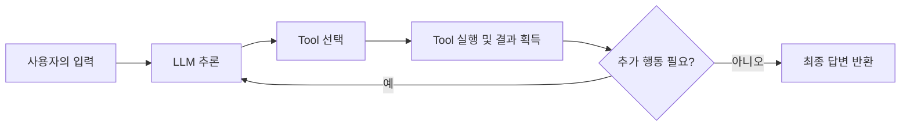

---

## 주요 Agent 패턴

### 1. ReAct (Reasoning + Acting) 패턴

- **특징**: LLM이 먼저 답변을 생성하기보다는 어떤 Tool을 사용할지 결정한 후 실행하는 방식임.
- **구체적 사례**: LangChain의 `zero-shot-react-description` Agent는 문맥 내에서 필요한 도구를 선택하고, 실행 후 도출된 결과를 바탕으로 다시 추론하여 최종 답변을 생성함.
- **예시**: 사용자 질문에 대해 단순 검색이나 계산이 필요한 경우, 해당 Tool을 실행하고 그 결과를 포함하여 답변하는 과정이 이에 해당됨.

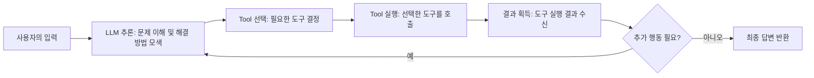

### 2. Plan & Execute 패턴

- [Plan & Execute](https://langchain-ai.github.io/langgraph/tutorials/plan-and-execute/plan-and-execute/)
- **특징**: 복잡한 멀티스텝 작업을 위해 **계획(Plan)** 수립과 **실행(Execute)** 단계를 명확하게 분리함.
- **구체적 설명**:
    - **계획 단계**에서는 문제를 여러 단계로 나누어 어떤 순서로 Tool을 실행할지 계획을 세움.
    - **실행 단계**에서는 계획에 따라 각 단계별로 Tool을 호출하고 결과를 종합함.
- **사용 예**: 복잡한 데이터 분석이나 여러 API를 순차적으로 호출해야 하는 작업에 효과적임.
- **예시**: 먼저 데이터를 수집(계획)한 후, 각각의 데이터를 가공 및 분석(실행)하여 최종 결과를 도출하는 작업 방식.

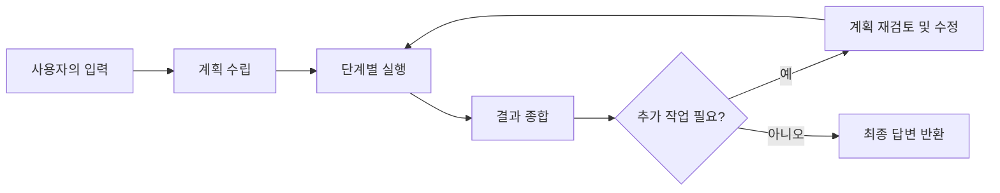

### 3. Self-Reflection Agent (자기 점검)

- [Reflection](https://langchain-ai.github.io/langgraph/tutorials/reflection/reflection/)
- **특징**: LLM이 스스로 생성한 결과를 검토하고, 오류를 점검하여 필요한 경우 수정하는 방식임.
- **구체적 설명**:
    - **피드백 루프**: 초기 결과를 생성한 후, 이를 재검토하여 누락이나 오류가 있는지 확인하고, 필요 시 수정 과정을 거침.
    - LangChain에서는 직접적인 구현 예시는 없으나, 커스텀 Agent로 이러한 피드백 루프를 적용할 수 있음.
- **사용 예**: 복잡한 질문에 대해 결과의 정확성을 높이고자 할 때 유용함.

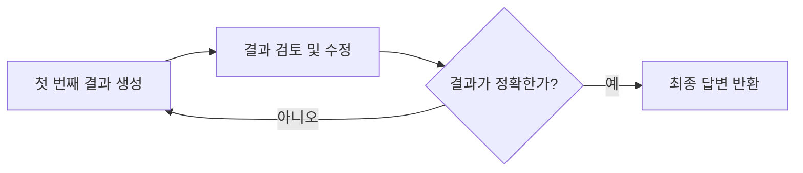

### 4. Conversational Agent (대화형)

- **특징**: 사용자의 이전 대화 이력을 기억하여 문맥을 유지하며 응답을 생성하는 방식임.
- **구체적 설명**:
    - **Memory 활용**: LangChain의 `ConversationalBufferMemory` 등을 사용하여, 이전 대화 내용을 저장 및 활용함.
    - **장점**: 지속적인 대화에서 사용자 의도를 보다 정확하게 파악하고, 일관된 답변을 제공할 수 있음.
    - **단점**: 메모리 관리가 제대로 이루어지지 않으면 대화 맥락이 불필요하게 누적될 수 있음.
- **사용 예**: 고객 지원 챗봇, 상담 시스템 등 연속 대화가 필요한 환경.

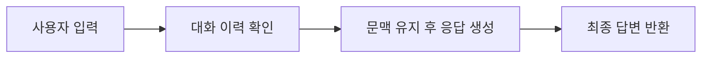

### 5. Function Calling (OpenAI Functions)

- **특징**: 미리 정의된 특정 API만을 실행하여, 보다 안전하고 예측 가능한 결과를 얻을 수 있는 방식임.
- **구체적 설명**:
    - **보안성 강화**: 사용 가능한 함수가 미리 제한되어 있어 외부 API 호출 시 발생할 수 있는 위험을 줄임.
    - **예측 가능성**: 특정 기능에 한정된 실행으로, 예상 가능한 결과를 도출할 수 있음.
- **사용 예**: 금융 데이터 조회, 예약 시스템 등 API 호출이 필요한 시스템.

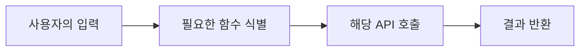

### 6. Multi-Agent Collaboration

- [Hierarchical Agent Team](https://langchain-ai.github.io/langgraph/tutorials/multi_agent/hierarchical_agent_teams/) / [Network](https://langchain-ai.github.io/langgraph/tutorials/multi_agent/multi-agent-collaboration/) 와 같은 세부 패턴 존재
- **특징**: 여러 Agent가 병렬 또는 순차적으로 협력하여 문제를 해결함.
- **구체적 설명**:
    - 각 Agent는 특정 역할 또는 도메인에 특화되어 있으며, 상호작용을 통해 더 복잡한 문제를 해결할 수 있음.
- **사용 예**: 항공권 예약 + 호텔 검색 + 차량 렌탈을 분리된 Agent가 처리한 후 통합 결과 제공.

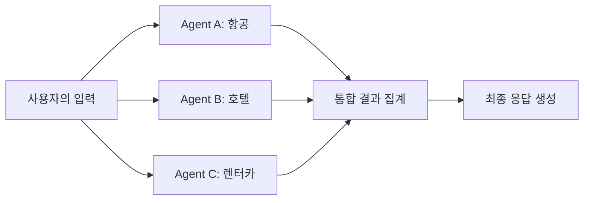

### 7. Supervisor Agent

- **특징**: 상위 LLM이 여러 하위 Agent에게 작업을 분배하고 결과를 통합함.
- **구체적 설명**:
    - Supervisor는 전체 목표를 분석하고, 필요한 Agent에 태스크를 위임한 후, 그 결과를 수집하여 최종 응답 생성.

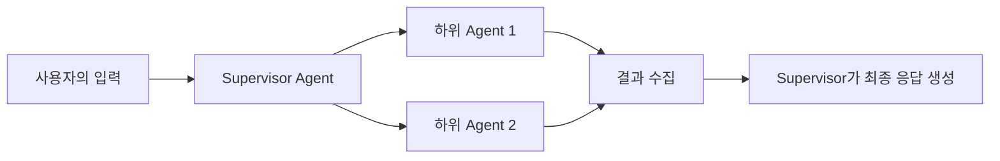

### 8. Hierarchical Agent

- **특징**: 문제를 상위 목표와 하위 태스크로 나누어 단계적으로 해결함.
- **구체적 설명**:
    - Team 또는 Tree 구조로 Agent를 구성하여 계층적으로 분할 처리.

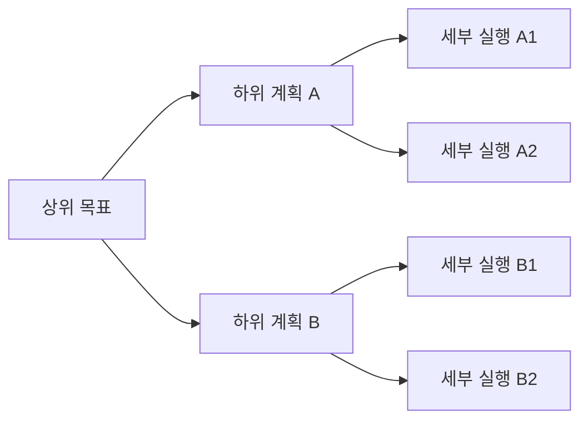

### 9. Reflective Retrieval Agent (Self-RAG, Corrective RAG)

- **특징**: 검색된 정보의 품질을 평가하고, 필요 시 재검색하거나 스스로 판단을 교정함.
- **구체적 설명**:
    - 초기 검색 결과를 검토하고, 부족하거나 부정확하면 다시 검색을 시도하거나 정보를 필터링함.

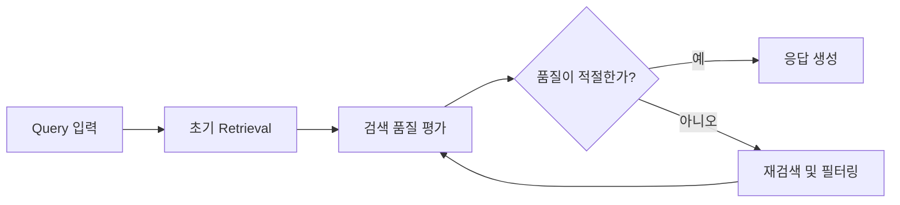

### 10. Tree of Thoughts (ToT)

- **특징**: 다양한 추론 경로를 생성하고, 각 경로를 평가하여 최적의 답을 선택함.
- **구체적 설명**:
    - 분기된 추론 경로를 탐색하고, 점수화 및 선택 과정에서 Reflection 기법 활용

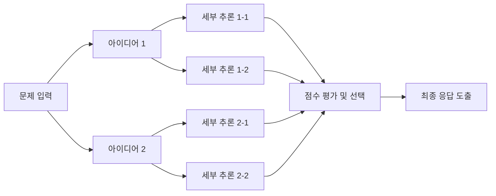

### 11. LLMCompiler / DAG Planning

- **특징**: 전체 플랜을 DAG(Directed Acyclic Graph)로 구성하고 병렬 및 순차 실행.
- **구체적 설명**:
    - 의존성이 있는 태스크는 순차 실행, 독립된 태스크는 병렬 처리하여 효율적으로 문제 해결

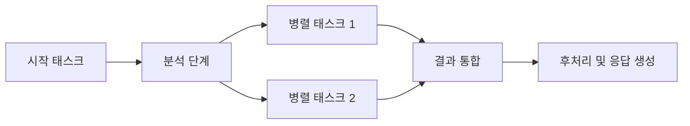

---

## Agent 패턴별 비교

| 패턴                   | 특징 및 구체적 설명                                          | 사용 예                        |
|------------------------|--------------------------------------------------------------|--------------------------------|
| **ReAct**              | 추론과 행동을 결합하여 Tool 선택 후 실행.                    | 일반적인 Tool 기반 챗봇        |
| **Plan & Execute**     | 문제를 여러 단계로 나누어 계획 수립 후 실행.                 | 복잡한 멀티스텝 작업           |
| **Self-Reflection**    | 초기 결과를 스스로 검토하고 수정하는 피드백 루프 적용.       | 오류 수정 및 품질 향상         |
| **Conversational**     | 대화 이력을 활용하여 문맥을 유지함.                          | 챗봇, 고객 지원                |
| **Function Calling**   | 미리 정의된 API 호출만 수행하여 보안성과 예측 가능성을 높임. | API 기반 시스템                |
| **Multi-Agent**        | 여러 Agent가 병렬 또는 순차로 협력함.                        | 항공/호텔/렌터카 통합 지원     |
| **Supervisor Agent**   | 상위 Agent가 하위 Agent에게 작업을 분배하고 결과를 통합함.   | 복잡한 워크플로우 조정         |
| **Hierarchical Agent** | 상-하위 계획으로 문제를 계층적으로 나눠 처리.                | 멀티 도메인 문제 해결          |
| **Reflective RAG**     | 검색 결과의 품질을 검토하고 수정 또는 재검색하는 RAG 전략.   | RAG 기반 QA 시스템             |
| **Tree of Thoughts**   | 추론 경로를 분기하여 탐색 후 점수를 기반으로 최적 경로 선택. | 창의적 문제 해결, 의사결정     |
| **LLMCompiler**        | DAG 기반 태스크 실행으로 효율적이고 병렬적인 작업 처리.      | 태스크 그래프 기반 시스템 구축 |

---

## 결론

LangChain과 LangGraph 기반의 Agent는 단순한 API 호출기를 넘어서 **추론과 행동**, 그리고 **다단계 계획과 협력적 수행**을 결합하는 강력한 지능형 시스템입니다.

- 기본적으로 **ReAct 패턴**을 사용하여 유연하게 도구를 선택 및 실행하지만,
- 복잡한 작업에는 **Plan & Execute**, **LLMCompiler**,
- 결과의 정확성을 높이기 위해 **Self-Reflection**, **Reflective RAG**,
- 연속적인 대화에서는 **Conversational**,
- 특정 API에 한정된 작업에는 **Function Calling**,
- 고도화된 협업 및 분산 처리가 필요한 경우 **Multi-Agent**, **Supervisor**, **Hierarchical Agent**, **Tree of Thoughts** 등의 패턴을 적용할 수 있습니다.
