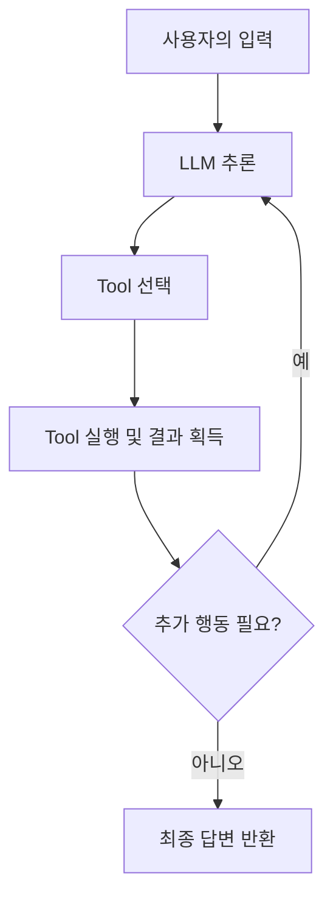
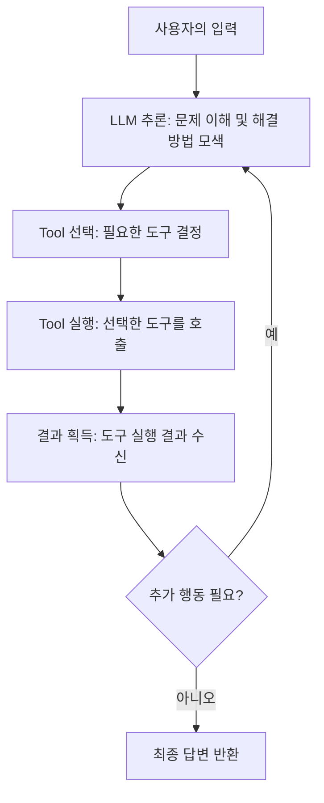
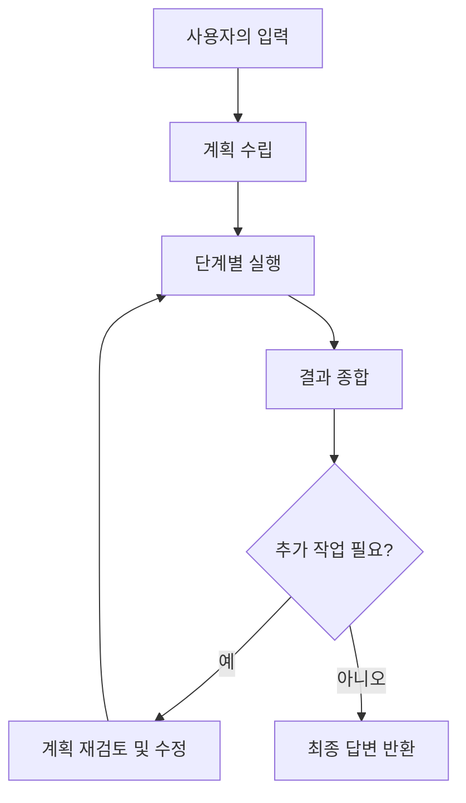
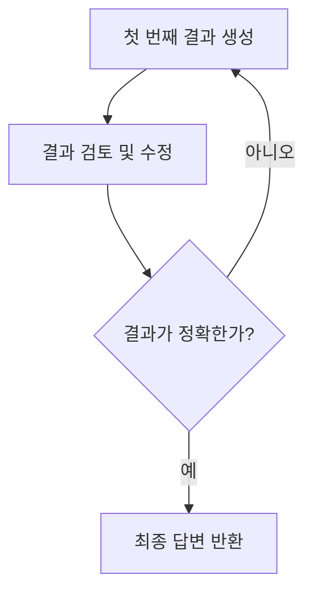
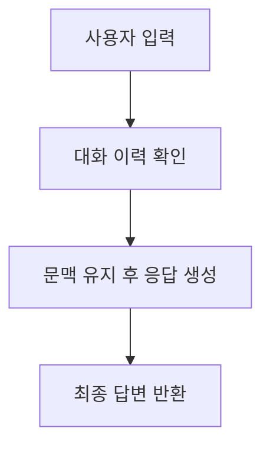
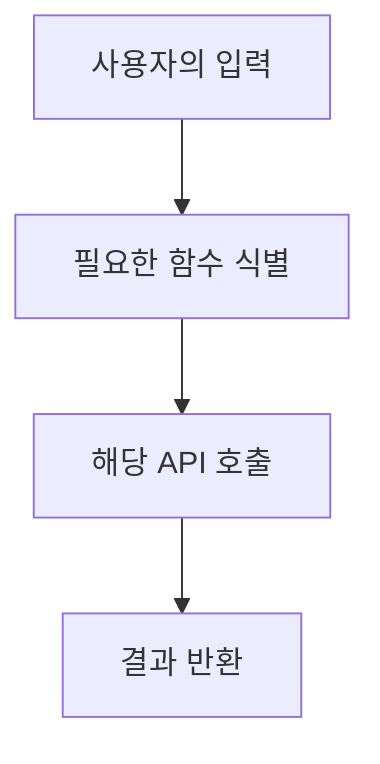

## TL;DR

- Agent는 사용자의 입력을 받아 Tool을 실행하고, 결과를 바탕으로 답변을 생성하는 구조임.
- **ReAct, Plan & Execute, Self-Reflection, Conversational, Function Calling** 등 여러 주요 패턴이 존재.
- LangChain에서는 기본적으로 ReAct 패턴을 사용하며, 상황에 따라 적절한 패턴을 선택하여 활용할 수 있음.

---

## Agent의 기본 구조

- **사용자 입력 수신**: 사용자가 메시지를 입력함.
- **LLM 추론**: 입력된 내용을 기반으로 어떤 Tool을 사용할지 결정하기 위해 추론함.
- **Tool 선택 및 실행**: 적절한 Tool을 선택하고 실행하여 결과를 얻음.
- **후속 행동 결정**: 추가 행동이 필요한지 판단하여 반복 실행할지 결정함.
- **최종 답변 반환**: 모든 과정이 완료되면 사용자에게 최종 답변을 전달함.

---

## 주요 Agent 패턴

### 1. ReAct (Reasoning + Acting) 패턴

- **특징**: LLM이 먼저 답변을 생성하기보다는 어떤 Tool을 사용할지 결정한 후 실행하는 방식임.
- **구체적 사례**: LangChain의 `zero-shot-react-description` Agent는 문맥 내에서 필요한 도구를 선택하고, 실행 후 도출된 결과를 바탕으로 다시 추론하여 최종 답변을 생성함.
- **예시**: 사용자 질문에 대해 단순 검색이나 계산이 필요한 경우, 해당 Tool을 실행하고 그 결과를 포함하여 답변하는 과정이 이에 해당됨.

### 2. Plan & Execute 패턴

- **특징**: 복잡한 멀티스텝 작업을 위해 **계획(Plan)** 수립과 **실행(Execute)** 단계를 명확하게 분리함.
- **구체적 설명**:
    - **계획 단계**에서는 문제를 여러 단계로 나누어 어떤 순서로 Tool을 실행할지 계획을 세움.
    - **실행 단계**에서는 계획에 따라 각 단계별로 Tool을 호출하고 결과를 종합함.
- **사용 예**: 복잡한 데이터 분석이나 여러 API를 순차적으로 호출해야 하는 작업에 효과적임.
- **예시**: 먼저 데이터를 수집(계획)한 후, 각각의 데이터를 가공 및 분석(실행)하여 최종 결과를 도출하는 작업 방식.

### 3. Self-Reflection Agent (자기 점검)

- **특징**: LLM이 스스로 생성한 결과를 검토하고, 오류를 점검하여 필요한 경우 수정하는 방식임.
- **구체적 설명**:
    - **피드백 루프**: 초기 결과를 생성한 후, 이를 재검토하여 누락이나 오류가 있는지 확인하고, 필요 시 수정 과정을 거침.
    - LangChain에서는 직접적인 구현 예시는 없으나, 커스텀 Agent로 이러한 피드백 루프를 적용할 수 있음.
- **사용 예**: 복잡한 질문에 대해 결과의 정확성을 높이고자 할 때 유용함.

### 4. Conversational Agent (대화형)

- **특징**: 사용자의 이전 대화 이력을 기억하여 문맥을 유지하며 응답을 생성하는 방식임.
- **구체적 설명**:
    - **Memory 활용**: LangChain의 `ConversationalBufferMemory` 등을 사용하여, 이전 대화 내용을 저장 및 활용함.
    - **장점**: 지속적인 대화에서 사용자 의도를 보다 정확하게 파악하고, 일관된 답변을 제공할 수 있음.
    - **단점**: 메모리 관리가 제대로 이루어지지 않으면 대화 맥락이 불필요하게 누적될 수 있음.
- **사용 예**: 고객 지원 챗봇, 상담 시스템 등 연속 대화가 필요한 환경.

### 5. Function Calling (OpenAI Functions)

- **특징**: 미리 정의된 특정 API만을 실행하여, 보다 안전하고 예측 가능한 결과를 얻을 수 있는 방식임.
- **구체적 설명**:
    - **보안성 강화**: 사용 가능한 함수가 미리 제한되어 있어 외부 API 호출 시 발생할 수 있는 위험을 줄임.
    - **예측 가능성**: 특정 기능에 한정된 실행으로, 예상 가능한 결과를 도출할 수 있음.
- **사용 예**: 금융 데이터 조회, 예약 시스템 등 API 호출이 필요한 시스템.

---

## Agent 패턴별 비교

| 패턴                   | 특징 및 구체적 설명                                               | 사용 예                           |
| -------------------- | ------------------------------------------------------------ | ------------------------------- |
| **ReAct**            | 추론과 행동을 결합하여 Tool 선택 후 실행.   *예: zero-shot-react-description Agent* | 일반적인 Tool 기반 챗봇             |
| **Plan & Execute**   | 문제를 여러 단계로 나누어 계획 수립 후 실행.   *예: 데이터 분석, 멀티 API 호출* | 복잡한 멀티스텝 작업                |
| **Self-Reflection**  | 초기 결과를 스스로 검토하고 수정하는 피드백 루프 적용.            | 오류 수정 및 품질 향상               |
| **Conversational**   | 대화 이력을 활용하여 문맥을 유지함.   *예: ConversationalBufferMemory* | 챗봇, 고객 지원                    |
| **Function Calling** | 미리 정의된 API 호출만 수행하여 보안성과 예측 가능성을 높임.         | API 기반 시스템 (예약, 금융 데이터 등) |

---

## 결론

LangChain의 Agent는 단순한 API 호출기를 넘어서 **추론과 행동을 자동으로 수행하는 패턴**을 따릅니다.

- 기본적으로 **ReAct 패턴**을 사용하여 유연하게 도구를 선택 및 실행하지만,
- 복잡한 작업에는 **Plan & Execute** 방식,
- 결과의 정확성을 높이기 위해 **Self-Reflection** 접근법,
- 연속적인 대화에서는 **Conversational** 패턴,
- 특정 API에 한정된 작업에는 **Function Calling** 방식을 활용할 수 있습니다.

상황과 요구에 맞게 각 Agent의 특성을 이해하고 적절한 패턴을 선택하면, 보다 효율적이고 정확한 시스템 구축이 가능합니다.
