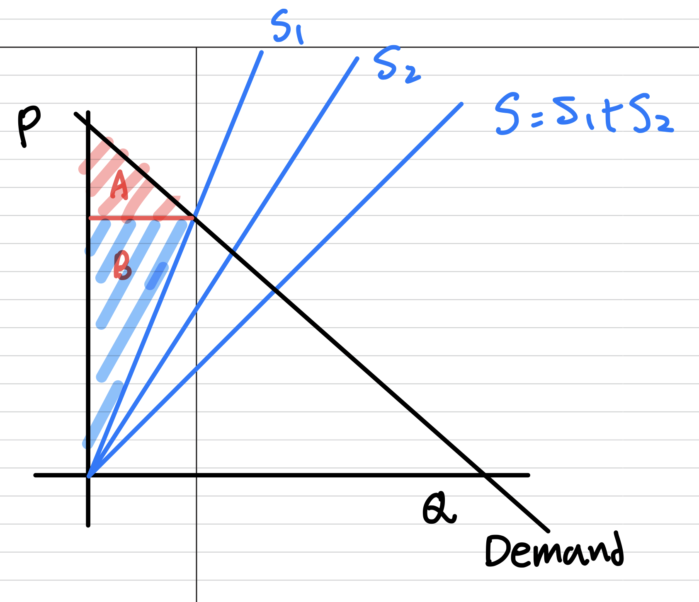
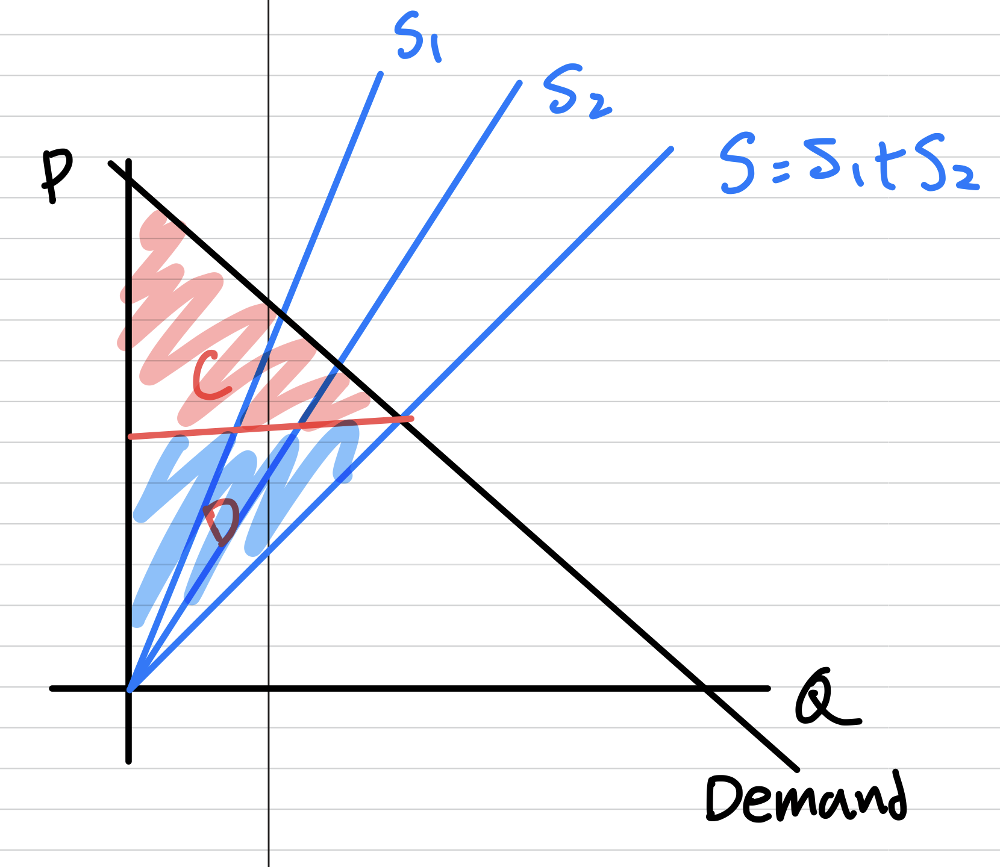
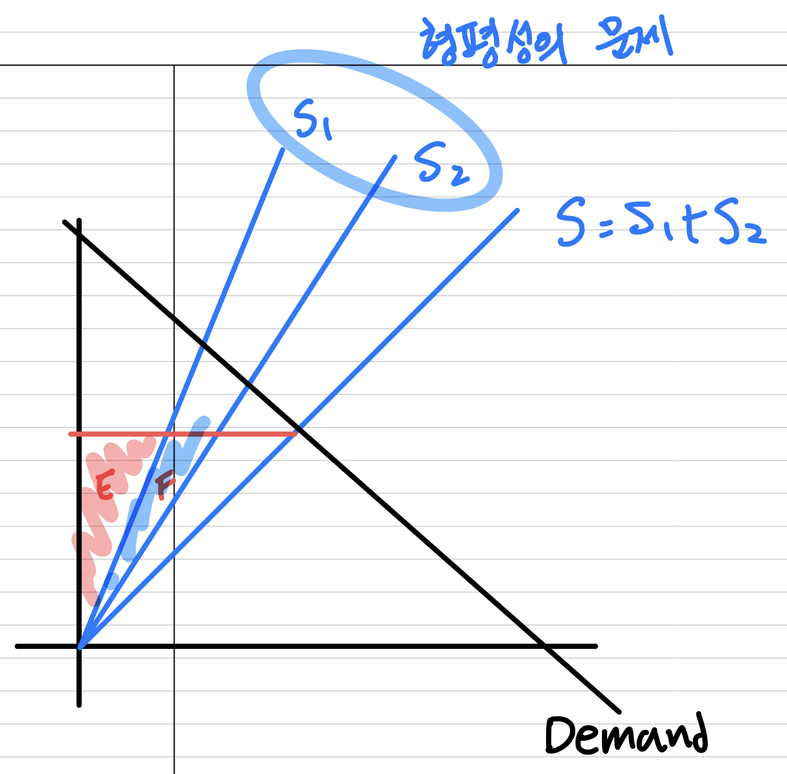
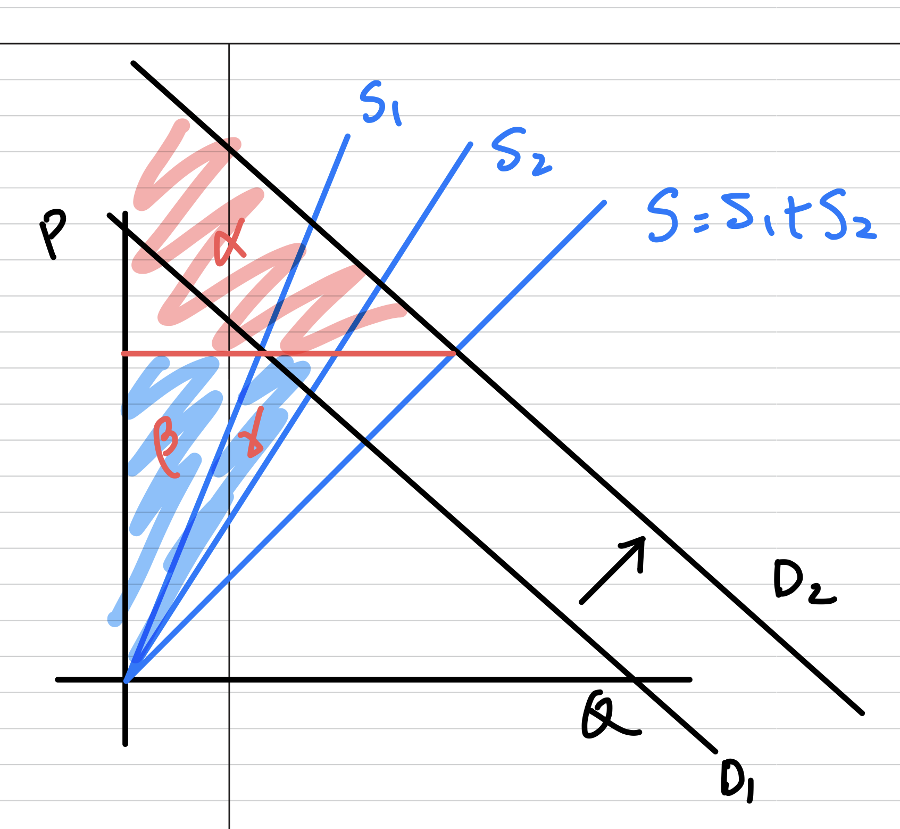

# 혁신이란 무엇일까 ?

- [최근 대법원에서 타다에 대한 위법성에 대한 결론이 나왔다.](https://www.lawtimes.co.kr/news/188048) 유사한 스타트업의 사례를 토대로 혁신에 대한 생각을 구체화하고 정리해두고자 함
- 일의 의미를 고민하던 중, 내가 하는 일은 시장의 어떤 문제를 해결하고 있으며 어떤 것이 혁신인가에 대한 생각을 하게 되었다. 기록해두고자 한다.

## 혁신의 사전적 의미

- 혁신이란 아이디어의 실용적인 구현이며, 그 결과로써 새로운 재화나 서비스 혹은 개선된 재화와 서비스를 생산해내는 것을 의미한다.
- 혁신의 사전적 의미를 찾아보면 [ 새롭고 가치 있는 것 ] 을 만들어야한다는 것 정도의 공통점이 있다.
- 그러나 [**새롭다**] 와 [**가치있다**]를 어떻게 정의하느냐에 따라서 구체적인 사례에서 의견이 달라질 수 있겠다.
- 구체적인 사례로서 타다를 옹호하는 측과 옹호하지 않는 측의 의견을 정리해보자.

## 타다 사례에 대한 두 가지 의견

<b>타다의 사례 - 박재욱 대표가 주장하는 타다가 혁신인 이유</b>

### 1. 타다는 주차 문제 및 환경문제를 야기하는 차량 문제를 해결한다

- **차량 문제**는 도시에서 **주차 문제 및 환경 문제**를 일으키고 있다.
- [라이드 헤일링](http://wiki.hash.kr/index.php/라이드헤일링) 서비스 [ 타다 서비스 ] 는 [ 차량의 소유 ]를 줄일 수 있는 좋은 방법이다.

<iframe width="560" height="315" src="https://www.youtube.com/embed/02vlEtV_7W4?si=RfHaFG7WwvfiC3vw" title="YouTube video player" frameborder="0" allow="accelerometer; autoplay; clipboard-write; encrypted-media; gyroscope; picture-in-picture; web-share" allowfullscreen></iframe>

### 2. 타다는 공유 경제의 대표적인 사례이며 일자리를 창출한다

- 이동의 문제가 해결되면 개인 승용차 시장은 줄어들고 **공유 자동차 시장이 커질 것**이다.
- 타다의 장점
    1. 사람들에게 탄력적인 일자리를 제공하고 있다.
    2. 기존 운송 서비스와 다르다
        1. 배차 시스템 → 승차 거부를 불가능하게 만드는 시스템을 만들었다.
        2. 친절하고 / 말을 걸지 않았으면 → 기본적인 가이드라인을 설정 기존보다 편리한 서비스를 제공한다.
    3. 자율 주행 기술을 열 데이터를 가지게 될 것이다.
        1. 데이터를 통해서 수요와 공급을 효과적으로 이어준다.
        2. 자율주행을 위한 데이터가 모일 것 ( 수요 데이터 / 주행 데이터 )
- 혁신적인 서비스란 시장에서 이용자가 판단하는 것이다.

<b>이준석 의원이 주장하는 타다가 혁신이 아닌 이유</b>

### 1. 비용구조를 생각해보면 동일한 비교가 아니다

- 비용 구조가 다르다

    <iframe width="560" height="315" src="https://www.youtube.com/embed/a55zX9dQGGo?si=puKGwisGS_Q7pwmX" title="YouTube video player" frameborder="0" allow="accelerometer; autoplay; clipboard-write; encrypted-media; gyroscope; picture-in-picture; web-share" allowfullscreen></iframe>

    - 대형 점보 택시와 거의 동일하다.
    - 택시에 대한 불만으로 택시가 아닌 것은 무조건 좋아보이는 현상이다.
        - 차가 깨끗해서 → 타다는 서비스가 생긴지 얼마 되지 않아서 차가 깨끗하다. → 택시는 5년 쓴다.
        - 서비스가 친절하다 → 타다 기사는 택시기사 출신이다. 사람이 달라지지 않는다. 택시 기사는 23명 ~ 25명 사이의 손님을 받고 타다 기사는 12 ~ 14명 손님을 받는다.
        - 예전 쿠팡맨 → 예전에는 좋았지만 → 업무 과중해지면 → 비슷해질수밖에 → 바뀐다. 타다 기사가 이직을 그렇게 많이 하는데 과연 좋은 것일지 ?
    - 타다는 적자를 내면서 운영하고 있다. 이런 상황에서 과연 공정한 비교가 되겠느냐 ?

### 2. 규제회피로 인한 생산 비용 감소에 따른 결과일 뿐. 지속가능한 사업이 아니다

- 규제 회피로 인한 생산 비용 감소에 따른 결과일 뿐. 지속가능한 사업이 아니다.

    <iframe width="560" height="315" src="https://www.youtube.com/embed/_OQdQSvqe-c?si=n_2vsb8K8T9L656E" title="YouTube video player" frameborder="0" allow="accelerometer; autoplay; clipboard-write; encrypted-media; gyroscope; picture-in-picture; web-share" allowfullscreen></iframe>

- 최저임금도 보장되지않는 고강도 노동 ( 300시간 200만원 정도 ~ 280 만원)
    - 이런 고강도 업무 속에서 서비스 교육으로 개선이 되겠느냐
- 하루 딱 두번 수요 > 공급인 시기 ( 출근 / 퇴근 ) 시간 당 2만원 나머지 평균 5천원 → 이것을 해결하기 위해서 카풀을 도입하면 → 택시비용만 인상 될 뿐이다.
- 타다 및 카카오 카풀 → 기사들이 버티지 못할 것 → 기사들의 노동력을 극한으로 끌어 올림
- 소비자에게 좋고 운전자에게도 좋다 → 그럼 왜 이직률이 그렇게 높겠느냐
- 택시 규제를 피하기 위해서 11인승 차 도입 → 비용 구조가 말이 안된다 → 모든 비용 구조가 택시보다 비싸다 → 그런데 어떻게 가능하냐 ? → 마케팅요소가 강하다 → 쿠팡의 예시를 보아라 → 규제 회피가 들어있는데 결국 이것은 노점상과 임대 상인들의 차이와 다를바 없다. 그 비용이 없으니까 싼 것일 뿐이다.
- 승차 거부는 본질적으로 저임금 구조에 따른 것

## 해석과 생각

- 기본적으로 혁신이라면
    1. 새로워야하고
    2. 유용해야함. 즉 사회적 가치를 창출해내야함
- 혁신이라는 것은 새로운 방법을 통해서 궁극적으로는 사회적 가치 ( = 사회 후생 ) 를 만들어 내는 것

### 경제적 후생을 기반으로 한 생각

<b>경제적 후생을 기반으로 한 생각</b>

- 위 두 사람의 주장의 차이는 혁신의 유용성, 즉 사회적 가치에 대한 견해의 차이에서 기인함
    - **[ 생존권 / 공정성 ] VS [ 사회 전체의 효율성 / 소비자의 편익 ]**
- 그렇기 때문에 논의를 이어나가기 위해서는 “사회적 가치 ( = 사회 후생 )” 이라는 개념에 대한 정립이 필요하다는 것을 깨달음
- 기본적으로 자본주의 사회에서 사회적 가치란 [Economic Surplus](https://en.wikipedia.org/wiki/Economic_surplus) ( = 경제적 후생 ) 를 따르는 것. 시장이 옹호될 수 있는 것은 완전 경쟁 시장에서 소비자 편익과 생산자 편익의 합이 최대가 되는 지점으로 시장을 이끌어 나가기 때문
- 주요한 쟁점은 각 사회적 가치 ( = 사회적 편익 ) 을 “재는 ( = measure )” 방법이 다를 수 있다는 점에서 논쟁의 여지가 있을 수밖에 없음. 예를 들어 공정성을 훼손하는 사회적 신뢰자본에 대한 비용은 단순한 수요 공급 모형으로 설명되기 어렵다는 것
- 그러함에도 불구하고 경제적 모델은 사회 현상을 이해하는 데 중요한 멘탈 모델이 될 수 있기 때문에 일부 한계가 있다고 하더라도, 경제적 후생의 차원에서 생각을 이어가고자 한다. 논의를 좁혀서 경제적 후생 측면에서만 고려해서 논의를 전개해보려고 함
- 간단한 형태의 수요 공급 곡선을 통해서 상황을 생각해보면

    - 소비자의 수요 곡선은 D 로 정의된다. S1 은 기존 택시 사업자들의 공급 곡선 ( Supply Curve ) 이다. S2 는 타다로 인해서 추가된 의 공급 곡선이다. 총 공급 곡선 S = S1 + S2 로 정의된다.
    - S2 ( 타다 ) 가 없는 상태에서는 균형 가격하에서, 위 그림과 같이 A 영역을 소비자 잉여, B 영역을 생산자 잉여로한다. 이 때 경제적 후생은 A + B 로 정의된다.

        

        
        

    - 이제 S2 가 추가된 상황에서 균형 가격은 재조정된다. 그러면 새로운 균형 가격 하에서 경제적 후생은 아래 C + D 영역으로 확대된다. 즉 경제적 후생이 증가한 것이다. 또한 조금 더 탄력적인 S2 가 시장에 유입됨에 따라서 시장의 공급 탄력성이 증가했다.

        

        
        

    - S2 가 추가된 새로운 균형 가격 하에서 생산자 편익의 분배를 살펴보자. 공급 곡선은 한계 비용 곡선과 동일하다. 따라서 규제에 따른 비용을 내지 않는 타다의 공급 곡선 S2 는 일반 택시의 공급 곡선 S1 보다 기울기가 낮을 수 밖에 없다. ( 동일한 가격에 대해서 더 많은 양을 제공할 수 있다. ) 이에 따라서 S1 ( 기존 사업자 ) 에게는 E 만큼의 생산자 편익이 돌아가지만, S2 ( 타다 ) 에게는 E + F 만큼의 생산자 편익이 돌아가게 된다. 사회적 총 편익은 늘었지만 생산자 편익의 분배에 있어서 차이가 발생했다. 이는 형평성에 맞지 않다. 박재욱 대표가 주장하는 것 처럼 공급의 탄력성이 증가함에 따라 소비자의 편익이 증가했지만, 이준석 의원의 주장대로 규제에 따른 비용구조로 차이에 기인한 분배의 문제 존재한다.

        

        
        

    - 박재욱 대표는 위 상황에서도 D1 → D2 라는 수요의 증대를 통해서 ( 모빌리티 시장의 개척과 확대 ) 모두가 승리할 수 있다고 이야기한다.

        

        
        

- 형평성의 문제가 발생한 것은 "규제"로 인한 생산 비용의 차이에서 기인한 것.
- 그러나 그 과정에서 최근 [대법원의 판례](https://www.scourt.go.kr/portal/news/NewsViewAction.work;jsessionid=uXu2JKXM01geX2b2dUo1ELKwnoYKZLaIkuzs6nDkNpnxELt9x56LYrDgGE7t0FCw.BJEUWS04_servlet_SCWWW?pageIndex=1&searchWord=&searchOption=&gubun=6&seqnum=2423)대로 적법한 형태였음.
- 타다는 위법성 여부에 대한 검토에 최선을 다했고, 대법원 판결에 따르면 시장의 규칙을 어긴 것이 아님.
- 그런 상황에서 타다는 적어도 합법적인 형태의 사업을 통해서 경제적 후생 ( = 사회적 후생 ) 을 높였기 때문에 혁신이라고 할 수 있다고 생각.

### 시스템의 규칙 설정자의 중요성

- 합법적인 형태이고 시장 시스템에서 경제적 후생을 높였다고 무조건 긍정하는 것은 아님. 법과 시장은 실패할 수 있음.
- 그러나 시장의 분배에서 발생하는 [시장 실패](https://en.wikipedia.org/wiki/Market_failure)를 보완하기 위해서 정부가 시장의 규칙을 제한하거나 바꿀 수 있음.
- 이것을 통해 시장 시스템의 수렴점이 최선의 분배가 되도록 시스템을 조정해야함.
- 시스템의 규칙을 잘 설정하는 것은 매우 중요함. 왜냐하면 시스템의 규칙은 그 자체가 균형점을 만들게 되기 때문

    

    
<b>faulty-reward-functions</b>

    - <https://openai.com/research/faulty-reward-functions>
        - 위 글은 OpenAI 의 oast Runners 라는 게임을 인공지능에게 학습시킨 fauly-reward-functions 라는 글임
        - 게임의 목적은 트랙을 다른 경쟁자보다 빠르게 달리는 것이 승리하는 것임. 그러나 게임의 목적함수 ( = 점수 ) 는 경쟁자와의 우위를 통해서 결정되는 것이 아니라, 트랙 내부의 아이템을 더 많이 획득하여 점수를 높힘으로써 결정됨
        - 그 결과 인공지능은 트랙 외부에서 벽에 부딪치며 가장 높은 점수를 획득하기 시작했고, 심지어는 트랙을 달리는 것이 아니라 특정 위치에서 “빙글 빙글 돌면서 점수를 획득하기 시작” 했음
        - 이러한 종류의 의도와 다르게 동작하는 것을 **[Misaligned goals in artificial intelligence](https://en.wikipedia.org/wiki/Misaligned_goals_in_artificial_intelligence)** 라고 하는데, 즉 어떠한 목적함수를 설정 하느냐에 따라 수렴하는 곳이 의도한 것과 달라질 수 있음을 보여줌
        - 즉 시스템의 수렴점은 바람직한 결과를 잘 반영하는 규칙에 의해서 결정된다고 할 수 있음. 따라서 시스템의 수렴을 바람직하게 만들기 위해서는 정교하게 설계된 시스템 ( = 규칙들 ) 이 필요

    

    - 기본적으로 시장에서 규칙을 정하는 것 ( 합법과 불법의 기준 ) 은 기업의 역할이 아니라고 생각함.
    - 책임은 권한과 함께하는데 기업은 시장의 규칙을 설정할 수 있는 권한이 없기 때문.
    - 주어진 규칙하에서 최적 분배 및 사회적 후생을 높힐 수 있다면 그것은 혁신기업이라고 정의할 수 있음.
    - 사회 기술적 지형이 바뀌어서 최적점이 바뀌었는데 그것을 인지하지 못하거나 사회적 이유로 인해서 Action Space 를 제한받음으로써 사회 전체 효율성이 떨어지는 현상은 계속 발생할 수 밖에 없음.
    - 혁신 기업은 이 부분을 찾아서 [시장의 문제]로 정의 후 해결해야함. 그리고 이 과정에서 기존 시스템의 규칙과 충돌이 일어날 수 있는데, 이것은 시스템 설계자 ( = 정부 ) 의 역할이 아닐까 싶음.
    - 시스템의 규칙이 적절하게 설정되지 않을 경우에는 [여기서](https://openai.com/research/faulty-reward-functions) 보여준 "빙글 빙글 도는 보트" 가 된다고 생각함.

### 현재 시스템이 만들어진 원인

- 택시가 현재와 같은 규제 구조를 가지게 된 원인은 물리적 제약조건에 따른 시장의 규칙이 적용되기 어려운 것에 기인했음. 그러나 기술의 발전에 의해서 상황이 변화했음
- [택시 기사조차 현재의 요금 규제로 인해서 어려움을 겪고 있음](https://www.youtube.com/watch?v=YiQvKeNvGXM)

    

    
택시가 현재와 같은 규제 구조를 가지게 된 원인

    - [택시가 현재와 같은 규제 구조를 가지게 된 원인](https://report.kakaomobility.com/post-corona-mobility-platform-and-taxi-market)은 얇은 시장의 문제를 가지고 있었기 때문. 얇은 시장은 공급자와 수요자가 소수만 있는 시장을 말하는데, 과거 배회영업이 주로 이루어지던 택시 시장이 대표적 사례
        - 물리적인 제약으로 공급자와 수요자가 효과적으로 거래 ( = 택시 승차 서비스 제공 ) 할 수단이 없었기 때문에 시장의 균형 가격으로 수렴하기 어려운 문제가 있었음. 이에 따라서 택시에 대해서는 요금 규제를 시행하고 공급량을 제한하는 규제를 펼침

    | 규제 종류 | 세부 규제  | 규제 근거 |
    | --- | --- | --- |
    | 양적 규제 ( 진입 규제 ) | 택시 면허 발급 제한| |
    | 사업 구역 제한 | 택시에 대한 수요가 일정치 않고 순환적인 반면, 택시 운전에는 특별한 기술을 요하지 않으므로 과다한 공급이 이뤄질 가능성이 높음 | |
    | 질적 규제 | 차량 규제 / 운전자 규제 / 서비스 규제 ( 승차거부 제한 등 ) | 교통안전, 차량 사고 등을 예방하기 위한 최소한의 서비스 질을 확보하기 위한 차원에서 필요 |
    | 요금 규제 | 운임 규제 / 부가서비스 요금 규제 | 소비자가 택시 서비스 및 가격을 비교하여 선택할 수 있는 여지가 거의 없고, 법적 제도적 장치 또는 우연적 요소 등에 의해 택시 서비스가 이용되는 불완전함 존재 |

    출처 : <https://report.kakaomobility.com/post-corona-mobility-platform-and-taxi-market>

    

### 그래서 타다는 혁신인가 ?

- 타다는 기술을 통해서 다음과 같이 문제를 해결하고자 했음
    1. 도덕적 헤이를 막기 위한 장치인 사납금 구조에서 기인한 승차 거부 → 차량의 위치를 파악하고 최적으로 배차를 함으로써 승차 거부를 없앰
    2. 탄력적인 수요에 비해 비 탄력적인 모빌리티 서비스의 공급 → 탄력적인 서비스 제공
    3. 부재한 피드백 시스템 쾌적하지 않은 사용자 경험 ( 말걸기 / 무례함 등 ) → 피드백 시스템 도입
- 실제로 기본적으로 모바일 플랫폼은 얇은 시장 문제를 어느정도 해결해 주었고 사회적 효용을 높여주었다고 생각함. 그래서 타다는 새롭고 / 유용했기 때문에 혁신 기업이라고 할 수 있음
- 타다로 인한 갈등은 일종의 시장 실패 ( = 시스템의 최적점이 우리가 바람직하다고 정의하는 포인트가 달라지는 것 ) 가 아닐까 싶음.
- 타다와 관련된 일련의 사건들은 어찌보면 혁신과 비혁신의 논쟁이 아님. 변화하는 시대에 맞춰 시스템의 규칙을 어떻게 적절하게 수정할 것인지에 대한 논의가 필요하다는 생각.

## 생각을 정리해보면

1. 해결되지 않던 문제를 해결함으로써 사회적 편익 증진에 기여하는 행위는 혁신이다.
    - [ 세상에 존재하는 문제 ]를 해결 하였다고 한다면, 도구 자체가 본질이 되지는 않는다고 생각함. 시장의 문제를 해결하였느냐 자체가 중요한 요소
        1. 세상에 존재하지 않거나 불가능할 것으로 여겨진 방법을 도입하거나
        2. 이미 존재하고 있었으나 시장에 받아들여지지 않았거나
        3. 방법론 자체와 상관없이 사회적 편익을 증가 시켰다면 그것은 혁신임
2. 새로운 시도를 하는 것만으로는 혁신이라고 할 수 없음. 혁신은 사회에 유용함을 제공해야함. 유용함 기준을 설정하는 것은 매우 어려움. 자본주의에서 시장에 대한 신뢰가 있다면 사회적 유용함은 경제적 후생으로 정의할 수 있음
    1. 기업은 주어진 룰 내에서 최적의 분배를 위한 노력을 하고 그것은 경제적 후생을 높여줄 것임.
    2. 그러나 주어진 룰의 최적 지점이 이 항상 바람직한 곳으로 수렴하는 것은 아님
3. 타다는 혁신이라고 생각함 - 카카오 모빌리티와 정확하게 동일한 논리로서
    - 공급의 탄력성을 높혔고 / 얇은 수요의 문제를 해결함으로써 기존의 규제로 인해서 충분히 극대화되지 못한 사회적 효용에 기여를 했기 때문
    - 여기서 의미하는 사회적 효용은 좁은 의미에서의 시장에서 측정되는 형태의 경제적 효용으로 한정함.
4. 기업은 시장의 참여자로서 시장의 규칙에 따라서 분배 최적화를 달성하고자 노력할 뿐임. 시장 실패를 극복하기 위한 규칙을 설정하는 책임은 시스템 설계자 ( = 정부 ) 에게 있음 → 시장 실패를 극복하기 위한 규칙의 수정을 어떻게 효과적으로 할 것인지에 대한 사회적 논의가 필요
    - 시장에서 분배 문제를 하나의 게임으로 보자면 → 결국 시스템 디자인이 매우 중요한 요소
    - 게임의 룰 자체를 수정 할 수 있다면 좋겠으나 기업은 그럴 권한이 없음
    - 게임의 룰을 넘어선 넓은 의미에서 기업이 사회적 선을 추구한다면 → 역할을 넘어서는 책임이 필요할 것
    - 결론적으로 시장에 의한 최적 분배에 대한 믿음이 있음. 물론 시장 실패로 인해 시장이 만능이 아니라는 것을 알고 있음. 이것을 해결하기 위해서 정부가 존재하고, 시장에서의 수렴값이 최선의 분배가 되도록 시스템을 설계하는 책임을 지고 있다고 생각함
    - 현실 경제에서는 시스템 ( = 법과 제도 ) 는 시장의 속도를 따라가는 것이 무리가 있음
    - 위 사례를 통해서 학습을 한다면 → 법과 제도가 현재 속도에 맞춰 수정될 수 있도록 만드는 방법에 대한 논의가 이어져야한다는 생각
    - 조금 더 바람직한 기업가라면 → 기업가는 본인에게 주어진 권한과 책임을 넘어서 → [ 시장에서 정의된 ] 최선이 아닌 [ 추상적으로 밖에 정의될 수 없는 ] 사회 전체에 대한 선에 대한 고민을 하고 그에 따라 움직일 것
5. 위 논의의 한계는 실증적으로 “타다” 서비스가 경제적 효용을 높히고 있다는 근거를 제시하지 못한 것. 위 논의를 보강하기 위해서는 실제로 사회적 편익이 높아지고 있다는 증거가 필요. 기본적으로 [ 시장의 문제 ] 를 해결 하였다는 것 → [ 시장의 ] 정량적인 지표를 통해서만 알 수 있다고 생각함.
    1. 회계 자료 또는 전체 모빌리티 시장의 크기와, 각 기업의 점유율 등을 통해서 사회적 편익을 측정해볼 수 있음. 그러나 정량적으로 경제적 효용을 높히고 있다는 증거를 찾고 나열하는 것은 해당 산업의 특성 ( 모빌리티 산업의 성장성과 시장의 성장 전망 등 )과 특수성 ( 규제 및 생존권 형평성 이라는 가치 ) 등 여러가지 요인에 의해서 달라질 수 있음. 이는 상당히 크고 복잡한 논의가 될 수밖에 없음.
    2. 타다의 사례를 통해서 “혁신”의 정의를 구체화하고자 했으나 → “새롭고 + 유용하다” 는 관점에서 “유용함”을 정의를 일반화하기가 까다롭다는 것을 깨달음
    3. 주어진 상황의 복잡성을 단순화 하기 위해서 [PMF 를 정량적으로 측정](https://www.notion.so/b3da29adc4d34406982c669bd9d70c3b?pvs=21)을 통해서 간접적으로 살펴볼 수 있을 것 → 궁극적으로는 매출로 이어져서 → 시장에서 효용을 측정할 수 있는 근거가 될테니까
6. 내가 속한 콴다는 시장을 혁신하고 있는가 ?
    - 콴다는 [ 기존에 없었던 문제 검색 시스템을 만들었다는 점에서 ] 새롭지만 [ 시장적 관점에서 ] 사회적 편익을 높히고 있다는 증거가 없다. 따라서 콴다는 아직은 혁신이 아니라고 할 수 있다.
    - 타다의 사례를 통해서 타다가 시장에서 문제를 효용을 높일 수 있는 가능성을 생각해보자면
        - 타다의 경우 → 기술을 통해 시장 참여자들의 매칭도를 높여줌으로써 얇은 수요의 문제를 해결했으며 & 탄력적 공급을 통해서 사회적 총 효용을 높였음
        - 콴다의 경우 → 기술을 통해서 “기존에는 불가능했던” 개인 맞춤형 교육을 실현하고자 함
            - PMF 를 정량적으로 측정하기 등을 통해서 유용함에 대한 최소한의 요건을 간접적으로 평가할 수 있을 것 ( 리텐션 등을 의미함 )
            - 앞으로 최소한의 매출을 통해서 소비자 편익이 존재한다는 것을 입증해야함
    - 혁신은 사회적으로 인정 받고 안정되기 전 까지 그에 대한 실증적인 증거를 회계 장표에서 찾기는 쉽지 않겠다는 생각 → 그래서 기업가 정신이 필요한 듯 → 엉뚱한 곳으로 빠지지 않도록 최소한의 요건들을 측정 해야겠지만 → 혁신 기업을 이끌 수 있는 원동력은 객관적인 사실보다는 허무맹랑한 꿈에 대한 믿음일지도 모르겠음
