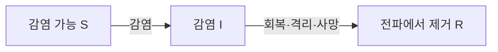

# 감염병의 유행은 왜 스스로 꺾이는가

- 감염병이 퍼지기 시작하면 감염자 수는 처음에 빠르게 증가한다.
- 그렇다고 감염자 수가 같은 속도로 영원히 증가하지는 않는다.
- 유행의 방향은 병원체 하나의 특성보다 감염될 수 있는 사람과 감염된 사람 사이의 상호작용으로 결정된다.
- 이 상호작용을 가장 단순하게 표현한 감염병 모델이 SIR 모델이다.

## 지수적 증가만으로는 유행을 설명할 수 없다

- 유행 초기에는 감염자 한 명이 여러 사람에게 감염을 전파한다.
    - 감염자 수가 두 배가 되면 새로운 감염을 일으킬 기회도 대략 두 배가 된다.
    - 이 구간의 감염자 수는 지수적으로 증가하는 것처럼 보인다.
- 현실의 유행은 어느 순간 정점을 지나 감소한다.
    - 이미 감염되었거나 면역을 얻은 사람은 다시 감염될 가능성이 작아진다.
    - 감염될 수 있는 사람이 줄어들면 감염자 한 명이 만들어내는 새로운 감염도 감소한다.
- 따라서 유행을 설명하려면 감염자 수뿐 아니라 사람들의 상태가 어떻게 이동하는지 함께 봐야 한다.

## SIR 모델

- SIR 모델은 전체 인구를 세 집단으로 나눈다.
    - $S(t)$, Susceptible: 아직 감염되지 않았고 감염될 수 있는 사람.
    - $I(t)$, Infectious: 감염되어 다른 사람에게 전파할 수 있는 사람.
    - $R(t)$, Removed: 회복하여 면역을 얻었거나 격리·사망 등으로 전파 과정에서 빠진 사람.
- 전체 인구 $N$이 일정하다고 가정하면 다음 관계가 성립한다.

$$
S(t) + I(t) + R(t) = N
$$

- 사람들의 상태 이동은 다음과 같다.

- 이 이동은 세 개의 미분방정식으로 표현된다.

$$
\frac{dS}{dt} = -\beta \frac{SI}{N}
$$

$$
\frac{dI}{dt} = \beta \frac{SI}{N} - \gamma I
$$

$$
\frac{dR}{dt} = \gamma I
$$

- 두 파라미터가 유행의 기본적인 속도를 결정한다.
    - $\beta$: 감염자와 감염 가능자의 접촉이 새로운 감염으로 이어지는 비율.
    - $\gamma$: 감염자가 단위 시간당 전파 과정에서 빠지는 비율.
        - 감염 기간이 지수분포를 따른다고 가정하면 평균 감염 기간은 $1/\gamma$다.
- 방정식의 핵심은 $SI$라는 곱이다.
    - $\beta SI/N$은 모든 사람이 서로 같은 확률로 만난다는 균질 혼합을 가정한다.
    - 감염자 $I$가 많아도 감염 가능자 $S$가 거의 없으면 새로운 감염은 적다.
    - 감염 가능자 $S$가 많아도 감염자 $I$가 없으면 유행은 시작되지 않는다.
    - 두 집단이 만나야만 새로운 감염이 발생한다.

## 유행이 커지는 조건

- 감염자 수의 변화식은 다음과 같이 묶을 수 있다.

$$
\frac{dI}{dt} = I\left(\beta \frac{S}{N} - \gamma\right)
$$

- 괄호 안의 값이 유행의 방향을 결정한다.
    - $\beta S/N > \gamma$이면 감염자 수가 증가한다.
    - $\beta S/N < \gamma$이면 감염자 수가 감소한다.
- 유행 초기에 거의 모든 사람이 감염 가능 상태라면 $S/N \approx 1$이다.
    - 이때 기본 재생산수는 다음과 같이 정의된다.

$$
R_0 = \frac{\beta}{\gamma}
$$

- $R_0$는 모두가 감염 가능하다는 단순한 조건에서 감염자 한 명이 평균적으로 만드는 2차 감염 수를 뜻한다.
    - $R_0 > 1$이면 작은 감염의 불씨가 큰 유행으로 성장할 수 있다.
    - $R_0 < 1$이면 감염은 대체로 사라진다.
- 유행이 진행된 뒤에는 감염 가능자의 비율을 반영한 유효 재생산수가 더 중요하다.

$$
R_e(t) = R_0 \frac{S(t)}{N}
$$

- 행동 변화, 방역 정책, 계절성까지 고려하면 $\beta$도 시간에 따라 달라질 수 있다.
    - 현실에서 데이터로 추정하는 $R_t$는 이런 변화와 관측 과정까지 반영하므로 위 식보다 복잡하다.
    - 단순 SIR의 $R_e(t)$는 재생산수가 왜 고정된 병원체 속성이 아닌지 보여주는 출발점이다.

## 정점은 유행의 끝이 아니다

- 감염자 수가 정점에 도달하는 조건은 $dI/dt = 0$이다.

$$
\frac{S}{N} = \frac{1}{R_0}
$$

- 이 시점부터 감염자 수는 감소하지만 새로운 감염은 계속 발생한다.
    - 정점은 매일 새로 유입되는 감염과 회복·격리로 빠지는 감염이 같아진 순간이다.
    - 정점 이후에도 감염자 집단이 남아 있으므로 누적 감염자 수는 계속 늘어난다.
- 집단면역 임계값으로 자주 소개되는 $1 - 1/R_0$도 같은 임계조건에서 나온다.
    - 유행이 시작되기 전에 이 비율만큼 완전한 면역을 갖는다면 $R_e \le 1$이 되어 큰 유행을 막을 수 있다는 이론적 기준이다.
    - 이미 진행 중인 유행의 정점에서 실제 면역 집단의 비율과 같은 값은 아니다.
    - 이 값은 균질한 접촉, 완전하고 지속되는 면역, 고정된 파라미터를 가정한다.
    - 현실의 백신 효과, 연령별 접촉, 지역 차이, 면역 감소를 그대로 반영한 목표값은 아니다.

## Lotka-Volterra 방정식과 닮은 점

- SIR 모델과 Lotka-Volterra 모델은 서로 다른 현상을 설명하지만 수학적 관점에서는 공통점이 있다.
    - 두 모델 모두 한 집단의 변화가 다른 집단의 크기에 의존한다.
    - Lotka-Volterra의 포식 항 $xy$와 SIR의 감염 항 $SI$는 두 주체가 만날 때 사건이 발생한다는 것을 표현한다.
    - 개별 주체의 성질보다 주체 사이의 상호작용이 전체 패턴을 만든다.
- 두 모델이 만드는 시간의 모양은 다르다.
    - 기본 Lotka-Volterra 모델은 포식자와 피식자의 되먹임으로 반복적인 궤도를 만든다.
    - 기본 SIR 모델은 사람이 $S$에서 $I$를 거쳐 $R$로 한 방향으로 이동하므로 하나의 유행 파동을 만든다.
    - 감염병의 반복 유행을 설명하려면 출생, 면역 감소, 계절성, 새로운 변이처럼 감염 가능자를 다시 채우거나 전파율을 바꾸는 과정이 필요하다.

## 현실에 가까워지기 위한 확장

- 기본 SIR 모델은 중요한 질문 하나를 선명하게 만드는 대신 많은 현실을 생략한다.
    - 사람들은 무작위로 동일하게 접촉하지 않는다.
    - 감염 직후 바로 전파 가능한 상태가 되지 않을 수 있다.
    - 면역은 영구적이지 않을 수 있다.
    - 감염자 수가 적을 때는 우연이 유행의 성패를 크게 좌우한다.
- 생략한 과정을 추가하면 서로 다른 모델이 된다.
    - SEIR 모델은 감염되었지만 아직 전파하지 않는 잠복 집단 $E$를 추가한다.
    - SIRS 모델은 면역이 감소하여 $R$에서 다시 $S$로 돌아가는 흐름을 추가한다.
    - 연령 구조 모델은 연령대별 접촉 빈도와 감염 위험을 구분한다.
    - 네트워크 모델은 가족, 학교, 직장처럼 실제 접촉 관계를 표현한다.
    - 확률 모델은 같은 조건에서도 유행이 우연히 꺼지거나 커질 가능성을 다룬다.
- 더 복잡한 모델이 항상 더 좋은 것은 아니다.
    - 추가한 구조만큼 더 많은 데이터와 가정이 필요하다.
    - 모델의 목적이 임계조건을 이해하는 것인지, 병상 수요를 예측하는 것인지, 정책을 비교하는 것인지에 따라 필요한 복잡도가 달라진다.

## 모델이 주는 통찰

- SIR 모델의 가치는 미래 숫자를 정확히 맞히는 데만 있지 않다.
- 단순한 방정식은 유행을 움직이는 인과 구조를 드러낸다.
    - 감염은 감염자와 감염 가능자의 만남에서 생긴다.
    - 유행의 성장은 전파와 제거 사이의 경쟁으로 결정된다.
    - 유행은 감염 가능자가 줄거나 전파율이 낮아질 때 꺾인다.
- 방역 수단도 같은 구조 위에서 해석할 수 있다.
    - 백신은 감염 가능자의 비율 $S/N$을 낮춘다.
    - 마스크, 거리 두기, 환기는 전파율 $\beta$를 낮춘다.
    - 빠른 진단과 격리는 평균 전파 기간 $1/\gamma$를 줄인다.
- 결국 감염병의 파동은 병원체가 혼자 만드는 곡선이 아니다.
    - 병원체, 사람들의 접촉, 면역, 행동, 정책이 서로 영향을 주고받은 결과다.
    - 미분방정식은 이 복잡한 현실에서 어떤 상호작용이 유행의 방향을 바꾸는지 생각하게 하는 지도다.

## 참고 자료

- W. O. Kermack and A. G. McKendrick, [A Contribution to the Mathematical Theory of Epidemics](https://doi.org/10.1098/rspa.1927.0118), 1927.
- ETH Zürich, [The SIR Model for Spread of Disease](https://tb.ethz.ch/education/learningmaterials/modelingcourse/level-1-modules/SIR.html).
