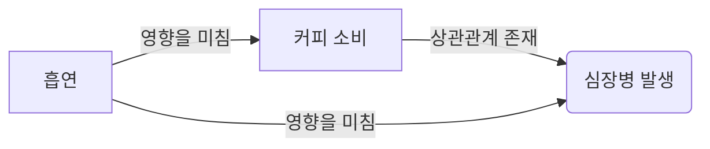

## TL;DR

- 교란변수(confounder)는 독립변수와 종속변수 간 관계를 왜곡할 수 있음.
- 이를 통제하지 않으면 잘못된 인과관계 추론이 발생할 수 있음.
- 실무에서는 데이터 수집, 분석 모델링 시 교란변수를 철저히 고려해야 함.
- 무작위 실험, 회귀 분석, 성향 점수 매칭 등의 전략이 효과적임.

## 교란변수란?

- 독립변수(X)와 종속변수(Y) 모두에 영향을 미치는 숨겨진 변수임.
- 원인과 결과의 관계를 착각하게 만들어 잘못된 결론을 유도할 수 있음.
- 예: 커피 소비와 심장병 간의 관계에서 흡연이 교란변수일 수 있음.

### 예시

## 교란변수가 실무에서 중요한 이유

- **정확한 비즈니스 의사결정 필요**
    - 마케팅 효과 분석 시, 단순한 상관관계만 보고 판단하면 ROI 분석이 왜곡될 수 있음.
- **의료 연구에서의 신뢰성 확보**
    - 특정 약물이 질병 예방에 효과가 있다고 결론 내리기 전에 생활 습관 등의 교란변수를 통제해야 함.
- **머신러닝 모델의 정확성 향상**
    - 예측 모델에 불필요한 상관관계가 포함되면, 모델이 잘못된 패턴을 학습할 위험이 있음.

## 교란변수 대응 전략

### 1. 무작위 실험(Randomization)

- **개념**:
    - 연구 대상들을 무작위로 실험 그룹과 대조 그룹에 배정하여 모든 변수들이 동등한 확률로 분포되도록 함.
- **어떻게 교란변수를 제거하는가?**
    - 무작위로 그룹을 나누면 알려진 교란변수뿐만 아니라 관측되지 않은 숨겨진 교란변수도 균등하게 배분됨.
    - 예: 신약 효과 연구에서 생활 습관이 무작위로 분포되도록 배정.
- **한계**:
    - 현실적으로 무작위 실험이 어려운 경우(비용, 윤리적 문제) 존재.

---

### 2. 다변량 회귀 분석(Multiple Regression)

- **개념**:
    - 종속변수에 영향을 미칠 수 있는 여러 독립변수를 동시에 분석하여 교란변수의 효과를 통제함.
- **어떻게 교란변수를 제거하는가?**
    - 교란변수를 회귀 모형에 포함함으로써 해당 변수의 효과를 분리하여 독립변수의 순수한 효과를 추정할 수 있음.
    - 예: 광고 효과 분석 시, 광고 예산뿐 아니라 계절성과 같은 교란변수를 추가.
- **한계**:
    - 모든 교란변수를 모델에 포함하는 것이 어려우며, 다중공선성 문제가 발생할 수 있음.

---

### 3. 성향 점수 매칭(Propensity Score Matching)

- **개념**:
    - 관측된 특성들을 기반으로 실험군과 대조군의 유사한 그룹을 매칭하여 교란변수의 영향을 줄이는 방법.
- **어떻게 교란변수를 제거하는가?**
    - 특정 기준(예: 연령, 성별, 소득 수준)을 기반으로 유사한 두 그룹을 만들어 비교하여 교란 효과를 최소화.
    - 예: 특정 건강 프로그램의 효과를 평가할 때, 참여자와 비참여자를 연령/건강 상태 기준으로 매칭.
- **한계**:
    - 완벽한 매칭이 어려울 수 있으며, 관측되지 않은 교란변수의 영향을 배제할 수 없음.

---

### 4. 층화 분석(Stratification)

- **개념**:
    - 데이터를 교란변수의 값에 따라 그룹으로 나누고 각 그룹 내에서 분석을 수행함.
- **어떻게 교란변수를 제거하는가?**
    - 교란변수의 수준별로 분석하여 그 영향을 고립시킴으로써 보다 정확한 비교가 가능해짐.
    - 예: 연령대를 나누어 각 그룹 내에서 건강 보조제의 효과를 따로 평가.
- **한계**:
    - 데이터가 충분하지 않으면 세분화할수록 통계적 유의성이 낮아질 수 있음.

---

### 5. 도메인 전문가의 의견 수렴

- **개념**:
    - 데이터 분석 전에 특정 분야의 전문가가 교란변수의 가능성을 예측하고 적절한 모델링 방식을 적용함.
- **어떻게 교란변수를 제거하는가?**
    - 사전 경험과 분석을 통해 주요 변수들 간의 관계를 명확히 정의하고, 추가적인 데이터를 수집하여 교란을 최소화함.
    - 예: 금융 데이터 분석 시, 거시경제 지표가 중요한 교란변수로 작용할 수 있음.
- **한계**:
    - 전문가의 주관이 개입될 수 있으며, 완전한 통제는 어려울 수 있음.

---

## 교란변수를 통제해야 하는 이유

- 잘못된 인과관계 해석을 방지하여 비즈니스 및 정책 결정의 정확성을 높임.
- 머신러닝 모델의 신뢰성을 강화하여 과적합(overfitting)을 방지.
- 연구 결과의 재현성과 타당성을 확보하여 과학적 근거를 강화.

## 마무리

- 교란변수는 분석의 신뢰성을 저해할 수 있으므로, 실무에서는 다양한 기법을 조합하여 철저히 통제해야 함.
- 무작위 실험이 이상적이지만, 현실적으로 다변량 회귀 분석, 성향 점수 매칭, 층화 분석 등과 같은 방법을 적절히 활용하는 것이 중요함.