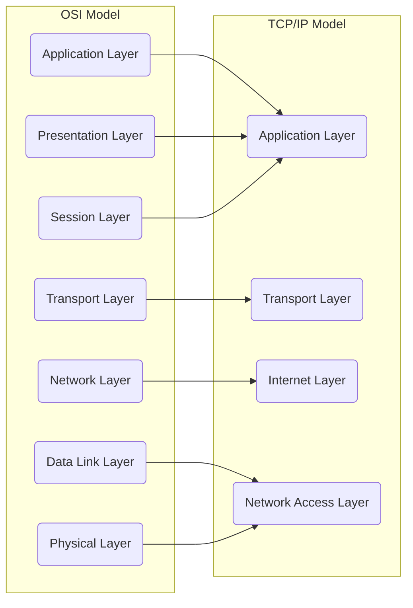

# 네트워크 계층 모델

- 인터넷 프로토콜 스위트는 인터넷에서 컴퓨터들이 서로 정보를 주고 받는 프로토콜의 집합
- OSI 7계층 모델 또는 TCP/IP 4계층 모델을 통해서 설명, 각각의 대응은 아래 그림과 같음

1. 애플리케이션 계층 (Application Layer)
    - FTP (File Transfer Protocol)
    - HTTP (HyperText Transfer Protocol)
    - SMTP (Simple Mail Transfer Protocol)
    - DNS (Domain Name System )
    - SSH (Secure Shell)
2. 전송 계층 (Transport Layer)
    - TCP (Transmission Control Protocol)
    - UDP (User Datagram Protocol)
    - QUIC (Quick UDP Internet Connections)
3. 인터넷 계층 (Internet Layer)
    - IP (Internet Protocol)
    - ICMP (Internet Control Message Protocol)
    - ARP (Address Resolution Protocol)
    - RARP (Reverse Address Resolution Protocol)
    - OSPF (Open Shortest Path First)
    - BGP (Border Gateway Protocol)
4. 네트워크 접근 계층 (Network Access Layer)
    - Ethernet
    - Wi-Fi
    - PPP (Point-to-Point Protocol)
    - SLIP (Serial Line Internet Protocol)
    - FDDI (Fiber Distributed Data Interface)
    - ATM (Asynchronous Transfer Mode)

---

1. Physical Layer
    - 케이블, 랜선, 허브, 모뎀 등등 물리적인 영역
    - 데이터는 1, 0 같은 **비트 스트림**으로 변환되서 물리적 전송을 담당
2. Data Link Layer
    - 기기와 기기 사이의 데이터 전송 부분을 말함
    - 데이터는 packet 단위에서 **frame** 으로 잘려서 전송이 되며, physical layer에서 발생할 물리적 전송 결함을 정정한다
    - 이더넷, 브릿지, 스위치 같은 장비들
3. Network Layer
    - 데이터는 segments 단위에서 **packets** 단위로 나뉜다
    - Routing 을 통해서 최적의 경로를 찾아낸다
4. Transport Layer
    - 데이터는 **segments** 단위로 나뉘게 된다.
    - flow control, 전송상의 에러 복구, 전송 대역등을 담당
5. Session Layer
    - 두 애플리케이션간의 연결을 설정, 유지 해제를 담당
    - 데이터 중간마다 syn 동기점을 삽입하여, 연결이 단절되거나 전송 오류가 발생시 -> syn 지점부터 다시 시작해서 처음부터 데이터를 다시 보내지 않도록 방지 한다
6. Presentation Layer
    - 데이터 변환, 암호화, 압축을 담당
    - HTTPS 사용시 데이터 암호화 하거나, 바이너리로 들어온 JPG, PNG등을 우리가 볼 수 있는 형태로 변환
7. Application Layer
    - 당신이 사용하는 소프트웨어 (웹브라우저, 이메일, Office365 등등)

## Reference

- <https://incredible.ai/engineering/2021/09/20/Basic-Engineering/#23-cap-%EC%9D%B4%EB%A1%A0%EC%97%90-%EB%8C%80%ED%95%B4%EC%84%9C-%EC%84%A4%EB%AA%85%ED%95%B4-%EB%8B%AC%EB%9D%BC>
