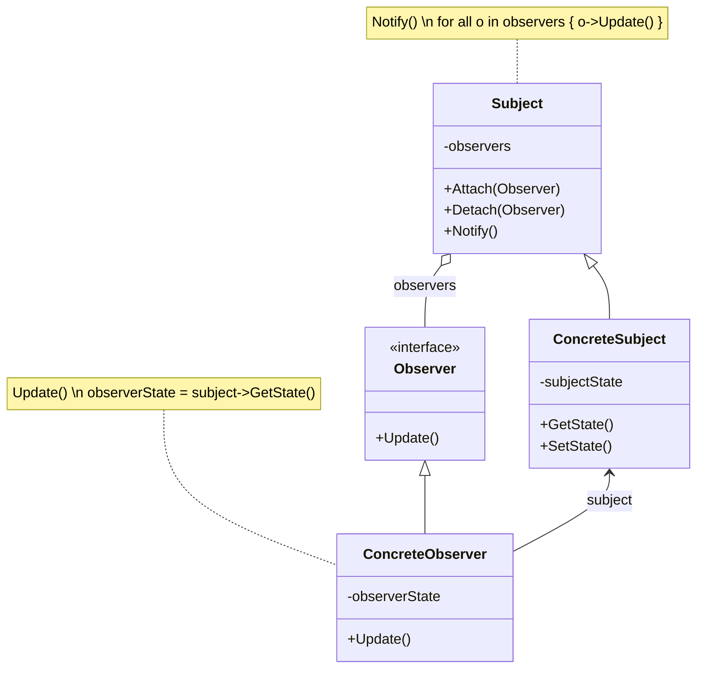

## TL;DR

Observer 패턴은 객체 간의 1:N 의존 관계를 정의하여 한 객체의 상태가 변경될 때, 그 변화가 의존 객체들에게 자동으로 통지되고 갱신되도록 하는 패턴임. 이를 통해 객체 간의 결합도를 낮추고 시스템의 유연성을 높일 수 있음.

## 개요

- **Observer 패턴은 객체 사이의 일관성을 유지하면서 결합도를 낮추기 위한 패턴**임.
- 주체(Subject)와 관찰자(Observer) 간의 관계를 정의하여, 주체의 상태 변화가 관찰자들에게 자동으로 통지됨.
- 이를 통해 객체 간의 **재사용성을 높이고 시스템의 확장성을 개선**할 수 있음.

## 동기

- 시스템을 여러 클래스로 분해할 때, **객체 간 일관성을 유지하는 것**이 어려움.
- 이를 위해 주체와 관찰자 간의 게시-구독 관계를 설정함.

## 활용성

- 추상 개념이 두 가지 양상을 가지며, 하나가 다른 하나에 종속적일 때 사용함.
- 한 객체의 변경이 여러 객체에 영향을 미치며, 그 수를 알 필요가 없을 때 유용함.
- 객체가 다른 객체에 자신의 변화를 통보할 수 있는데, 그 대상이 누구인지 몰라도 될 때 적합함.

## 구조



- **Subject**: 관찰자들을 알고 있는 주체로, 관찰자를 추가하거나 제거하는 인터페이스를 제공함.
- **Observer**: 주체의 변화에 관심이 있는 객체로, 객체를 갱신하는 인터페이스를 정의함.
- **ConcreteSubject**: 상태를 저장하고, 변경이 발생할 때 관찰자에게 통보함.
- **ConcreteObserver**: 주체의 상태와 일관성을 유지하기 위해 상태를 갱신함.

## 협력 방법

- ConcreteSubject는 상태 변경 시 Observer에게 통보함.
- ConcreteObserver는 통보받은 후 주체의 상태를 조회하여 자신의 상태를 갱신함.

## 결과

- 주체와 관찰자를 독립적으로 변경하기 쉬워져 재사용성이 높아짐.
- 추상적 결합도로 인해 유연성이 증가함.
- Broadcast 방식으로 통지할 수 있어 수신자를 모를 때도 통보 가능함.
- 단점으로는 불필요한 갱신이 발생할 수 있고, 그 비용을 예측하기 어려움.

## 구현 고려사항

Observer 패턴을 구현할 때, 다양한 설계 요소들을 고려해야 함.

### 1. Subject와 Observer의 맵 관리

- Subject와 Observer의 관계를 효율적으로 관리하기 위해 별도의 자료구조를 사용할 수 있음.
    - 많은 Subject와 적은 Observer가 있는 경우, 각 Subject가 직접 Observer 리스트를 관리하는 것보다 탐색용 자료구조를 사용하는 것이 나을 수 있음.
    - 다만, 별도의 객체를 관리해야 하는 부담과 불필요한 Observer 중복 관리가 발생할 수 있음.
- 하나 이상의 Subject를 구독하는 Observer가 있을 때 문제를 고려해야 함.
    - 여러 Subject를 구독하는 Observer는 `Update` 메서드에서 어떤 Subject로부터 호출되었는지 알기 위해 추가 정보가 필요할 수 있음.

### 2. 갱신을 Trigger하는 주체 결정

- Subject가 자체적으로 갱신을 Trigger하는 경우가 있음.
    - 상태가 변경될 때마다 `notify`를 호출해 자동으로 통지함.
    - 그러나 과도한 호출이 발생할 수 있어 성능 문제가 생길 수 있음.
- 클라이언트가 갱신을 Trigger하는 경우도 있음.
    - 상태 변경 후 `notify`를 호출해 불필요한 갱신을 줄일 수 있음.
    - 하지만 클라이언트가 실수로 `notify`를 호출하지 않을 위험이 있음.

### 3. 삭제된 Subject에 대한 참조 문제

- Subject가 삭제될 때 Observer에게 알림이 필요함.
    - Subject가 삭제될 때 해당 Subject를 참조하는 Observer가 계속 참조를 유지하면 문제가 발생할 수 있음.
    - 이를 방지하려면 Subject가 삭제되기 전에 Observer들에게 자신을 제거하라고 알리는 메시지를 보내야 함.

### 4. Notify 호출 전 Subject의 상태 일관성 보장

- Notify 호출 순서를 신경 써야 함.
    - `notify` 호출 전에 Subject의 상태가 일관성을 가져야 함.
    - 상태가 완전히 갱신되기 전에 `notify`가 호출되면 잘못된 상태가 전달될 수 있음.
    - 템플릿 메서드를 사용해 상태 변경 이후에 `notify`가 호출되도록 해야 함.

### 5. 감시자별 갱신 프로토콜 관리 (푸시/풀 모델)

- 푸시 모델: Subject가 업데이트 정보를 Observer에게 직접 전달함.
    - Subject가 변경된 상태 정보를 Observer에게 푸시함.
    - 이 경우 Subject가 Observer의 필요 정보를 알아야 하므로 결합도가 생김.
- 풀 모델: Observer가 필요할 때 Subject로부터 정보를 가져옴.
    - Subject는 상태가 변경되었음을 알리고, Observer가 필요할 때 정보를 가져옴.
    - 이 방식은 결합도를 낮출 수 있음.

### 6. 관심 있는 변경 사항 지정

- Observer가 자신이 관심 있는 변경 사항을 명확히 지정해야 함.
    - 불필요한 갱신을 줄이고 효율성을 높일 수 있음.

### 7. 복잡한 갱신 구조의 캡슐화

- ChangeManager 객체를 통해 갱신 책임을 분리할 수 있음.
    - ChangeManager는 Subject와 Observer의 매핑을 관리하고, 갱신 전략을 정의하며, Observer의 업데이트를 총괄함.
    - 이러한 구조는 여러 객체의 상태 변화를 조율하는 Mediator 패턴의 일종임.

## 결론

Observer 패턴은 강력한 설계 도구이지만, 구현 시 다양한 요소를 고려해야 함. 이 패턴의 성공적인 구현은 시스템의 복잡성을 낮추고, 유지보수성을 높이며, 성능을 최적화할 수 있음.

## 관련 패턴

- ChangeManager는 주체와 관찰자 사이의 중재자로서의 역할을 수행하며, 단일체 패턴을 통해 시스템에서 하나만 존재하도록 할 수 있음.

## 코드 예시

<details markdown="1">
<summary>일반적인 Observer 패턴 구현</summary>

```python
from abc import ABC, abstractmethod

# Observer 인터페이스
class Observer(ABC):
    @abstractmethod
    def update(self, subject):
        pass

# Subject 클래스
class Subject:
    def __init__(self):
        self._observers = []
        self._state = None

    def attach(self, observer: Observer):
        self._observers.append(observer)

    def detach(self, observer: Observer):
        self._observers.remove(observer)

    def notify(self):
        for observer in self._observers:
            observer.update(self)

    def set_state(self, state):
        self._state = state
        self.notify()

    def get_state(self):
        return self._state

# ConcreteObserver 구현
class ConcreteObserver(Observer):
    def __init__(self, name):
        self._name = name
        self._observer_state = None

    def update(self, subject: Subject):
        self._observer_state = subject.get_state()
        print(f"Observer {self._name} updated with state: {self._observer_state}")

# 사용 예시
subject = Subject()
observer1 = ConcreteObserver("Observer 1")
observer2 = ConcreteObserver("Observer 2")

subject.attach(observer1)
subject.attach(observer2)

subject.set_state("State 1")
subject.set_state("State 2")
```

</details>

<details markdown="1">
<summary>ChangeManager를 이용한 Observer 패턴 구현</summary>

```python
from abc import ABC, abstractmethod

# Observer 인터페이스
class Observer(ABC):
    @abstractmethod
    def update(self, subject):
        pass

# Subject 클래스
class Subject:
    def __init__(self):
        self._state = None

    def set_state(self, state):
        self._state = state
        ChangeManager.notify(self)

    def get_state(self):
        return self._state

# ConcreteObserver 구현
class ConcreteObserver(Observer):
    def __init__(self, name):
        self._name = name
        self._observer_state = None

    def update(self, subject: Subject):
        self._observer_state = subject.get_state()
        print(f"Observer {self._name} updated with state: {self._observer_state}")

# ChangeManager 클래스
class ChangeManager:
    _observers = {}

    @classmethod
    def register(cls, subject: Subject, observer: Observer):
        if subject not in cls._observers:
            cls._observers[subject] = []
        cls._observers[subject].append(observer)

    @classmethod
    def unregister(cls, subject: Subject, observer: Observer):
        if subject in cls._observers:
            cls._observers[subject].remove(observer)

    @classmethod
    def notify(cls, subject: Subject):
        if subject in cls._observers:
            for observer in cls._observers[subject]:
                observer.update(subject)

# 사용 예시
subject1 = Subject()
subject2 = Subject()

observer1 = ConcreteObserver("Observer 1")
observer2 = ConcreteObserver("Observer 2")

ChangeManager.register(subject1, observer1)
ChangeManager.register(subject1, observer2)
ChangeManager.register(subject2, observer2)

subject1.set_state("Subject 1 - State A")
subject2.set_state("Subject 2 - State B")
```

</deatils>