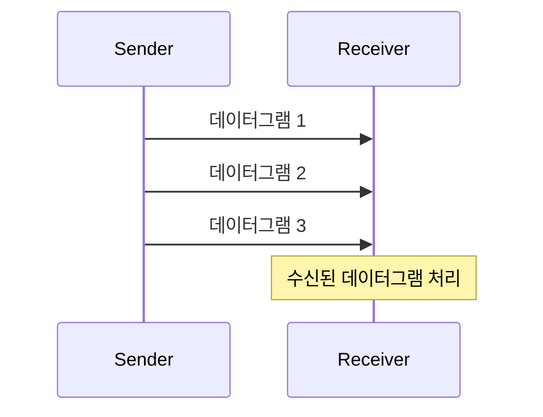

# 1. TL; DR

- TCP는 신뢰성 있는 데이터 전송을 제공하기 위해 설계된 프로토콜로, 연결 지향적이며 데이터의 순서 보장, 오류 검출 및 재전송, 흐름 제어, 혼잡 제어 등의 기능을 제공합니다. 웹 브라우징, 파일 전송, 이메일, 원격 접속 등 다양한 응용 프로그램에서 널리 사용됩니다. 반면, UDP는 신뢰성보다는 속도가 중요한 스트리밍, 온라인 게임, VoIP 등에 사용됩니다.

- UDP는 빠르고 효율적인 데이터 전송을 제공하지만, 신뢰성을 보장하지 않습니다. TCP와 달리 연결 설정 단계가 없으며, 데이터그램은 독립적으로 전송됩니다. UDP는 실시간 애플리케이션, 스트리밍, 온라인 게임, VoIP, DNS 등에서 주로 사용됩니다. 이러한 특징 덕분에 UDP는 오버헤드가 적고, 전송 속도가 중요한 응용 프로그램에 적합합니다.

- TCP와 UDP(User Datagram Protocol)는 모두 전송 계층 프로토콜이지만, 그 특성과 사용 사례가 다릅니다.

| 특징           | TCP                                        | UDP                                      |
| -------------- | ------------------------------------------ | ---------------------------------------- |
| 연결 지향 여부 | 예                                         | 아니오                                   |
| 신뢰성         | 예 (데이터 순서 보장, 오류 검출 및 재전송) | 아니오 (데이터 순서 보장 및 재전송 없음) |
| 흐름 제어      | 예                                         | 아니오                                   |
| 혼잡 제어      | 예                                         | 아니오                                   |
| 속도           | 느림 (오버헤드 큼)                         | 빠름 (오버헤드 작음)                     |
| 사용 사례      | 웹 브라우징, 파일 전송, 이메일, 원격 접속  | 스트리밍, 온라인 게임, VoIP              |

## 1.1. TCP

- TCP (Transmission Control Protocol)는 인터넷과 다른 네트워크에서 데이터를 신뢰성 있게 전송하기 위해 사용되는 주요 프로토콜 중 하나입니다. TCP는 데이터 전송의 신뢰성과 정확성을 보장하기 위해 여러 메커니즘을 사용합니다. 여기에서는 TCP의 주요 특징, 작동 원리, 그리고 일반적인 사용 사례에 대해 설명하겠습니다.

### 1.1.1. TCP의 주요 특징

- **연결 지향적**:
    - TCP는 데이터를 전송하기 전에 송신자와 수신자 간에 연결을 설정합니다. 이 연결 설정 과정은 **3-way 핸드셰이크**라고 불립니다.
- **신뢰성 있는 전송**:
    - TCP는 데이터가 정확하고 순서대로 도착하도록 보장합니다. 이를 위해 데이터 패킷에 시퀀스 번호를 부여하고, 수신자는 데이터 패킷을 확인(ACK)하여 송신자가 데이터 수신을 확인하도록 합니다.
    - 손실된 패킷이나 손상된 패킷은 다시 전송됩니다.
- **흐름 제어**:
    - TCP는 송신자가 수신자의 처리 속도에 맞추어 데이터를 전송하도록 조절하는 **흐름 제어** 메커니즘을 사용합니다. 이를 통해 수신자가 데이터를 감당할 수 있는 속도로 받도록 합니다.
- **혼잡 제어**:
    - 네트워크 혼잡을 방지하기 위해 TCP는 데이터 전송 속도를 조절하는 **혼잡 제어** 메커니즘을 사용합니다. 혼잡이 감지되면 전송 속도를 줄이고, 혼잡이 해소되면 전송 속도를 점진적으로 증가시킵니다.

### 1.1.2. TCP의 작동 원리

1. **3-way 핸드셰이크**:
    - TCP 연결을 설정하기 위해 송신자와 수신자는 세 단계의 핸드셰이크 과정을 거칩니다.
    - **SYN**: 송신자는 연결 요청 메시지(SYN)를 수신자에게 보냅니다.
    - **SYN-ACK**: 수신자는 연결 요청을 수락하고 응답 메시지(SYN-ACK)를 송신자에게 보냅니다.
    - **ACK**: 송신자는 수신자의 응답을 확인하고 확인 메시지(ACK)를 보냅니다. 이제 연결이 설정되었습니다.

    ```mermaid
    sequenceDiagram
        participant Client
        participant Server
        Client->>Server: SYN
        Server->>Client: SYN-ACK
        Client->>Server: ACK
    ```

2. **데이터 전송**:

    - 데이터는 세그먼트(segment)로 나뉘어 전송됩니다. 각 세그먼트는 시퀀스 번호를 포함하여 순서가 보장됩니다.
    - 수신자는 각 세그먼트를 수신하고 확인 응답(ACK)을 보냅니다. 손실된 세그먼트가 있으면 재전송을 요청합니다.

   ```mermaid
   sequenceDiagram
    participant Client
    participant Server
    Client->>Server: 데이터 세그먼트 1 (Seq=1)
    Server->>Client: ACK (Ack=2)
    Client->>Server: 데이터 세그먼트 2 (Seq=2)
    Server->>Client: ACK (Ack=3)
    Client->>Server: 데이터 세그먼트 3 (Seq=3)
    Server->>Client: ACK (Ack=4)
   ```

3. **연결 종료**:

    - 연결을 종료하기 위해 양쪽 모두 **4-way 핸드셰이크** 과정을 거칩니다.
    - **FIN**: 연결 종료 요청 메시지(FIN)를 송신자가 보냅니다.
    - **ACK**: 수신자가 FIN 메시지를 확인하고 응답합니다.
    - **FIN**: 수신자도 연결 종료 요청 메시지(FIN)를 송신자에게 보냅니다.
    - **ACK**: 송신자가 FIN 메시지를 확인하고 응답합니다. 이제 연결이 종료되었습니다.

    ```mermaid
    sequenceDiagram
     participant Client
     participant Server
     Client->>Server: FIN
     Server->>Client: ACK
     Server->>Client: FIN
     Client->>Server: ACK
    ```

### 1.1.3. TCP의 일반적인 사용 사례

1. **웹 브라우징**:
    - HTTP/HTTPS 프로토콜은 TCP를 사용하여 웹 서버와 클라이언트 간의 데이터를 신뢰성 있게 전송합니다.

2. **파일 전송**:
    - FTP(File Transfer Protocol)는 TCP를 사용하여 파일을 신뢰성 있게 전송합니다.

3. **이메일**:
    - 이메일 전송에 사용되는 프로토콜(예: SMTP, IMAP, POP3)은 TCP를 사용하여 이메일 메시지를 신뢰성 있게 전송합니다.

4. **원격 접속**:
    - SSH와 같은 원격 접속 프로토콜은 TCP를 사용하여 안전하고 신뢰성 있는 연결을 제공합니다.

## 1.2. UDP

- UDP (User Datagram Protocol)는 TCP와 달리 연결 지향적이지 않은 전송 계층 프로토콜입니다. UDP는 빠르고 효율적인 데이터 전송을 위해 설계되었으며, 다음과 같은 주요 특징을 가지고 있습니다.

### 1.2.1. UDP의 주요 특징

1. **비연결 지향**:

    - UDP는 데이터를 전송하기 전에 송신자와 수신자 간에 연결을 설정하지 않습니다.
    - 데이터그램(패킷)은 독립적으로 전송되며, 각 패킷은 그 자체로 목적지에 도착하기 위한 모든 정보를 포함합니다.

2. **신뢰성 없음**:

    - UDP는 데이터 전송의 신뢰성을 보장하지 않습니다. 패킷이 손실되거나, 중복되거나, 순서가 뒤바뀔 수 있습니다.
    - 패킷 손실 시 재전송을 위한 메커니즘이 없습니다.

3. **빠른 전송 속도**:

    - UDP는 오류 검출 및 재전송과 같은 오버헤드가 없기 때문에 TCP보다 전송 속도가 빠릅니다.
    - 실시간 애플리케이션(예: 스트리밍, 온라인 게임)에서 주로 사용됩니다.

4. **단순한 헤더 구조**:
    - UDP 헤더는 8바이트로 매우 단순하며, 송신자와 수신자의 포트 번호, 패킷 길이, 간단한 체크섬을 포함합니다.

### 1.2.2. UDP 작동 원리

- UDP는 데이터를 패킷 단위로 전송합니다. 각 패킷은 독립적으로 처리되며, 패킷이 전송되는 순서나 성공 여부에 대한 보장이 없습니다. 다음은 UDP 데이터 전송의 일반적인 흐름입니다:

1. **데이터그램 생성**:

    - 송신자는 전송할 데이터를 데이터그램(UDP 패킷)으로 나눕니다.
    - 각 데이터그램에는 송신자와 수신자의 포트 번호, 패킷 길이, 데이터 및 간단한 체크섬이 포함됩니다.

2. **데이터그램 전송**:

    - 송신자는 네트워크를 통해 데이터그램을 수신자에게 보냅니다.
    - 각 데이터그램은 독립적으로 전송되며, 전송 순서가 보장되지 않습니다.

3. **데이터그램 수신**:
    - 수신자는 도착한 데이터그램을 수신하여 처리합니다.
    - 손실되거나 순서가 뒤바뀐 데이터그램에 대한 처리는 애플리케이션 레벨에서 수행해야 합니다.

### 1.2.3. UDP의 일반적인 사용 사례

1. **스트리밍**:
    - 비디오 및 오디오 스트리밍에서는 약간의 데이터 손실이 허용되며, 빠른 전송이 중요합니다. 예: YouTube, Netflix.
2. **온라인 게임**:
    - 실시간 게임에서는 빠른 반응이 필요하며, 약간의 데이터 손실이 게임 진행에 큰 영향을 미치지 않습니다. 예: FPS 게임, MMORPG.
3. **VoIP(Voice over IP)**:
    - 음성 통화에서는 빠른 전송이 중요하며, 약간의 데이터 손실이 통화 품질에 큰 영향을 미치지 않습니다. 예: Skype, Zoom.
4. **DNS(Domain Name System)**:
    - DNS 요청은 단순히 호스트 이름을 IP 주소로 변환하는 작업으로, 매우 짧은 응답 시간이 필요합니다.

### 1.2.4. UDP 작동 원리 다이어그램

- UDP는 연결 설정 과정이 없기 때문에 TCP의 3-way 핸드셰이크나 4-way 핸드셰이크와 같은 절차가 없습니다. 대신, 송신자가 데이터그램을 바로 전송하고, 수신자는 이를 바로 수신하는 매우 간단한 구조입니다.

- UDP 데이터 전송 Mermaid 다이어그램



- 이 다이어그램에서 볼 수 있듯이, UDP는 데이터 전송을 위해 별도의 연결 설정 단계가 없으며, 송신자는 데이터를 바로 수신자에게 보냅니다. 수신자는 도착한 데이터그램을 처리하게 됩니다.

## 1.3. Python Example

socket.SOCK_STREAM: TCP 소켓을 생성합니다. 연결 지향적이며, 신뢰성 있는 데이터 전송을 제공합니다.

```python
import socket
from threading import Thread

def handle_client(conn, addr):
    print(f"{addr}와 연결되었습니다.")
    with conn:
        while True:
            data = conn.recv(1024)
            if not data:
                break
            print(f"받은 데이터: {data.decode()}")
            conn.sendall(data)  # 클라이언트에게 에코

def start_tcp_server(host='127.0.0.1', port=65432):
    with socket.socket(socket.AF_INET, socket.SOCK_STREAM) as s:
        s.bind((host, port))
        s.listen()
        print(f"TCP 서버가 {host}:{port}에서 대기 중입니다.")
        while True:
            conn, addr = s.accept()
            client_thread = Thread(target=handle_client, args=(conn, addr))
            client_thread.start()

start_tcp_server()
```

```python
import socket

def start_tcp_client(host='127.0.0.1', port=65432):
    with socket.socket(socket.AF_INET, socket.SOCK_STREAM) as s:
        s.connect((host, port))
        s.sendall(b'Hello Server!')
        data = s.recv(1024)
    print(f"서버로부터 받은 데이터: {data.decode()}")

start_tcp_client()
```

socket.SOCK_DGRAM: UDP 소켓을 생성합니다. 비연결 지향적이며, 빠른 데이터 전송을 제공합니다.

```python
import socket
from threading import Thread

def start_udp_server(host='127.0.0.1', port=65432):
    with socket.socket(socket.AF_INET, socket.SOCK_DGRAM) as s:
        s.bind((host, port))
        print(f"UDP 서버가 {host}:{port}에서 대기 중입니다.")
        while True:
            data, addr = s.recvfrom(1024)
            print(f"{addr}로부터 받은 데이터: {data.decode()}")
            s.sendto(data, addr)  # 클라이언트에게 에코


start_udp_server()
```

```python
import socket

def start_udp_client(host='127.0.0.1', port=65432):
    with socket.socket(socket.AF_INET, socket.SOCK_DGRAM) as s:
        message = b'Hello UDP'
        s.sendto(message, (host, port))
        data, server = s.recvfrom(1024)
    print(f"서버로부터 받은 데이터: {data.decode()}")

start_udp_client()

```

### 1.3.1. WSGI server

- gunicorn 또는 uWSGI 와 같은 WSGI 서버는 HTTP 요청을 수신하고, 이를 애플리케이션으로 전달합니다. HTTP는 TCP 위에서 동작하므로, WSGI 서버는 TCP 소켓을 통해 데이터를 주고받습니다.

### 1.3.2. TCP 연결 처리

- WSGI 서버는 TCP 소켓을 열고 클라이언트로부터의 연결을 수신합니다. 클라이언트가 HTTP 요청을 보내면, 이 요청은 TCP를 통해 서버에 도달합니다.
- WSGI 서버는 수신한 TCP 패킷을 HTTP 요청으로 변환하고, 이를 애플리케이션에 전달합니다.
- 애플리케이션은 HTTP 요청을 처리하고, HTTP 응답을 생성합니다.
- 생성된 HTTP 응답은 다시 TCP를 통해 클라이언트로 전송됩니다.

## 1.4. Reference

- 참고하기 좋은 글 <https://incredible.ai/network/2015/09/12/TCP-101/>