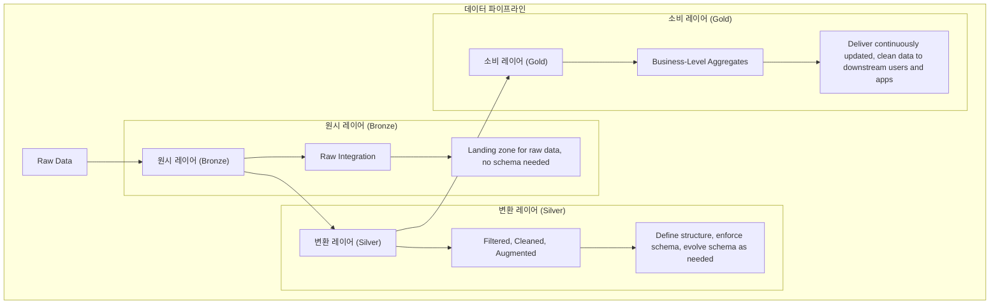

## TL;DR

- 표준 패턴 사용, 데이터 유효성 검사, 데이터 중복 방지, DRY 코드 작성, 파이프라인 실행 메타데이터 추적, 테스트 활용 등 은 데이터 파이프라인 구축 시 고려해야 할 모범 사례임

## 데이터 파이프라인 모범사례

### 1. 표준 패턴을 사용하여 데이터를 점진적으로 변환

- 데이터 파이프라인은 원시(Raw), 변환(Transformed), 소비(Consumption) 레이어로 구성됨.
- 원시 레이어 ( Raw Layer or Bronze Layer )
    - 상류 소스 시스템에서 데이터를 그대로 저장.
    - 메타데이터 컬럼을 포함하여 데이터 계보 추적과 재처리 용이성을 제공.
- 변환 레이어 ( Transformed Layer or Silver Layer )
    - 원시 레이어 데이터를 표준화하고 정제하여 엔터프라이즈 관점을 제공.
    - ELT 방식을 사용하여 빠른 데이터 로드 및 최소한의 변환 적용.
- 소비 레이어 ( Consumption Layer or Gold Layer )
    - 변환된 데이터를 소비 준비 상태로 조합.
    - 읽기 최적화된 데이터 모델을 사용하여 보고서 작성 및 고급 분석을 지원.
- 입력이 되는 상류를 Upstream, 출력이 되는 하류를 Downstream이라고 부르기도 함.

- 참고
    - Apache Spark의 [Medallion Architecture](https://www.databricks.com/glossary/medallion-architecture)
    - [dbt의 프로젝트 구조](https://docs.getdbt.com/best-practices/how-we-structure/1-guide-overview)

### 2. 데이터를 소비자에게 노출하기 전에 유효성을 확인 (데이터 품질 검사, DQ)

- 데이터를 소비자에게 노출하기 전에 유효성을 확인해야 함.
- Great Expectations 라이브러리 등을 사용하여 유효성 검사할 수 있음
- 과도한 데이터 품질 검사는, 파이프라인 실행 시간과 비용을 높힐 수 있기 때문에 적절한 수준의 검사를 수행

### 3. 중복 데이터를 피하기 위한 멱등성 파이프라인

- 필연적으로 Backfilling 또는 오류 발생 시 재처리를 수행해야 하는데, 이 때 중복 데이터를 방지해야 함.
- [멱등성(idempotence)](/8feb5ca2-1b5d-4e9b-aa95-c3cc19b3fada) 을 보장하는 파이프라인 설계가 필요함.
- 구현
    - Run ID 기반 덮어쓰기: Run Id 는 데이터 생성된 시간 범위로 보통 잡음 ( e.g. 생성된 날짜 ) 이를 기반으로 덮어쓰기를 통해서 Idempotent를 보장
    - 키 기반 UPSERTS: 키를 사용하여 기존 행을 업데이트하거나 새로운 행을 삽입. SCD ( Slowly Changing Dimension ) 등을 처리할 때 사용.

### 4. DRY 코드 작성 및 I/O를 데이터 변환에서 분리

- 반복 코드 최소화 ( Don't Repeat Yourself, DRY )
    - 코드 : 코드 중복을 최소화하여 유지보수성을 높임
    - 패턴 : 데이터를 처리하는 패턴을 따르도록 하여, 코드의 일관성 및 중복 방지.
- I/O와 변환 로직 분리: I/O 함수는 변환 로직에서 분리하여 테스트 및 디버깅 용이성 제공.
- OOP 의 SRP 를 생각해보면 됨. I/O 와 데이터 변환은 서로 다른 책임을 가지고 있음.

### 5. 파이프라인 실행의 메타데이터를 추적하여 디버깅 용이성 확보

- 파이프라인 실행 메타데이터 추적: 각 처리 단계에 대한 입력 및 출력, 시작 및 종료 시간, 재시도 횟수 등을 추적.
- 데이터셋 메타데이터 관리: 유일 키 (PK), 물리적 저장 위치, 테이블 이름, 저장 형식, 파티션 키, 데이터 스키마 등을 버전 관리.

### 6. 코드 동작을 확인하고 기존 로직을 깨뜨리지 않도록 테스트 활용

- 테스트 유형: 단위 테스트, 통합 테스트, 엔드 투 엔드 테스트를 통해 코드 동작 확인.
    - 단위 테스트: 개별 함수가 예상대로 작동하는지 확인.
    - 통합 테스트: 두 개 이상의 시스템이 예상대로 함께 작동하는지 확인.
    - 엔드 투 엔드 테스트: 시스템이 시작부터 끝까지 예상대로 작동하는지 확인.
- 테스트 실행: pytest를 사용하여 테스트 케이스를 실행.

### Reference

- <https://www.startdataengineering.com/post/de_best_practices/>
