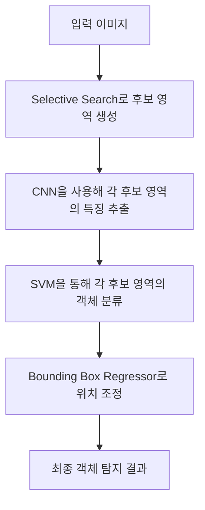

## TL;DR

- RCNN(Region-based Convolutional Neural Networks)은 객체 탐지를 위한 방법론을 제시.
- Selective Search를 통해 후보 영역을 생성하고, 각 영역에 CNN을 적용하여 객체를 분류함.
- RCNN은 높은 정확도를 달성했으나, 연산 비용이 매우 큼.
- 2 stage 방식의 Fast RCNN, Faster RCNN 등이 이후 등장하여 RCNN의 성능을 개선

## Problem

- Sliding Window와 같은 방법들은 객체 탐지의 정확도가 낮고, 비효율적
- HOG(Histogram of Oriented Gradients)와 같은 전통적인 방법들은 객체 탐지의 정확도가 낮음.

## Contribution

- selective search를 통해 후보 영역을 생성, Sliding Window 방식보다 효과적
- CNN을 적용하여 Feature 추출, Hand-crafted feature(HOG, SIFT 등)보다 높은 정확도.
- ResNet 등의 최신 CNN 모델을 사용하여 객체 탐지의 정확도를 높임.
- Bounding Box Regressor를 사용하여 객체의 위치를 조정

## 기본 개념

- RCNN은 입력 이미지에서 여러 후보 영역(Region of Interest, RoI)을 생성하여 각각의 영역에서 객체를 탐지하는 방법임.
- Selective Search 알고리즘을 사용하여 수천 개의 후보 영역을 추출함.
- 각 후보 영역에 대해 CNN을 적용하여 특징을 추출하고, 이를 바탕으로 SVM을 사용해 객체를 분류함.

<details markdown="1">
<summary>Selective Search</summary>

```python
import numpy as np
import cv2
from skimage.segmentation import slic
from skimage.color import rgb2lab
from scipy.spatial.distance import euclidean
from itertools import combinations

def compute_color_histogram(region):
    # RGB 색상 히스토그램 계산
    hist = np.zeros(25)
    for pixel in region:
        bin_index = (pixel[0] // 64) * 9 + (pixel[1] // 64) * 3 + (pixel[2] // 64)
        hist[bin_index] += 1
    hist /= len(region)
    return hist

def initialize_regions(img, segments):
    # 초기 영역 설정: 각 초기에 분할된 영역을 개별적으로 다룸
    regions = {}
    for y in range(img.shape[0]):
        for x in range(img.shape[1]):
            segment_label = segments[y, x]
            if segment_label not in regions:
                regions[segment_label] = {
                    "labels": [segment_label],
                    "pixels": [],
                }
            regions[segment_label]["pixels"].append(img[y, x])

    for key in regions.keys():
        regions[key]["histogram"] = compute_color_histogram(regions[key]["pixels"])

    return regions

def merge_regions(r1, r2):
    # 두 영역을 병합하여 새로운 영역을 생성
    new_region = {
        "labels": r1["labels"] + r2["labels"],
        "pixels": r1["pixels"] + r2["pixels"],
    }
    new_region["histogram"] = compute_color_histogram(new_region["pixels"])
    return new_region

def selective_search(img, k=200):
    # 이미지의 SLIC 세그먼트 계산
    segments = slic(img, n_segments=k, compactness=10)

    # 초기 영역 설정
    regions = initialize_regions(img, segments)

    # 병합 가능한 영역들의 쌍을 생성
    region_pairs = list(combinations(regions.keys(), 2))

    while region_pairs:
        # 각 영역 쌍에 대해 유사성 계산 (단순히 색상 히스토그램 간의 유클리드 거리)
        min_distance = float('inf')
        best_pair = None
        for (r1_key, r2_key) in region_pairs:
            r1 = regions[r1_key]
            r2 = regions[r2_key]
            distance = euclidean(r1["histogram"], r2["histogram"])
            if distance < min_distance:
                min_distance = distance
                best_pair = (r1_key, r2_key)

        # 가장 유사한 영역 병합
        if best_pair:
            r1_key, r2_key = best_pair
            new_region = merge_regions(regions[r1_key], regions[r2_key])
            new_key = max(regions.keys()) + 1
            regions[new_key] = new_region
            del regions[r1_key]
            del regions[r2_key]

        # 병합 후 새로운 영역 쌍 계산
        region_pairs = list(combinations(regions.keys(), 2))

    return regions

# 테스트 이미지 불러오기
img = cv2.imread('path_to_image.jpg')
img_rgb = cv2.cvtColor(img, cv2.COLOR_BGR2RGB)

# 선택적 검색 수행
regions = selective_search(img_rgb, k=100)

# 영역 시각화
output_img = img_rgb.copy()
for region in regions.values():
    for (y, x) in region["pixels"]:
        output_img[y, x] = [255, 0, 0]  # 병합된 영역을 빨간색으로 표시

cv2.imshow('Selective Search Output', cv2.cvtColor(output_img, cv2.COLOR_RGB2BGR))
cv2.waitKey(0)
cv2.destroyAllWindows()

```

- 초기 군집형성에는 SLIC(Simple Linear Iterative Clustering) 알고리즘을 사용함.
- 다른 종류의 군집화 알고리즘을 사용할 수도 있음.
- **SLIC (Simple Linear Iterative Clustering)**
    - **목적**: SLIC 알고리즘은 이미지를 슈퍼픽셀(superpixel)로 분할하는 방법입니다. 슈퍼픽셀은 서로 비슷한 색상과 인접한 픽셀들을 그룹화한 작은 영역입니다.
    - **작동 방식**: SLIC는 K-means 클러스터링을 기반으로 동작하며, 색상과 공간 정보를 결합하여 이미지를 슈퍼픽셀로 나눕니다. 이는 이미지의 중요한 경계를 유지하면서도 연관성이 있는 픽셀들을 그룹화하는 데 효과적입니다.
    - **장점**: SLIC는 빠르고 효율적이며, 결과적으로 생성되는 슈퍼픽셀이 매우 규칙적이고 균일합니다. 이는 후속 이미지 처리 작업, 예를 들어 객체 인식이나 세그먼테이션, 트래킹 등에 유리합니다.

- **Felzenszwalb's Efficient Graph-Based Image Segmentation**
    - **목적**: Felzenszwalb 알고리즘은 이미지의 물체 경계를 고려한 세그먼테이션을 수행하는 알고리즘입니다. 이 알고리즘은 그래프 기반 방법을 사용하여 이미지의 픽셀들을 군집화합니다.
    - **작동 방식**: 이 방법은 각 픽셀을 그래프의 노드로 보고, 노드 간의 유사성을 엣지로 표현합니다. 유사성이 높은 픽셀들(즉, 엣지의 가중치가 작은 픽셀들)을 연결하여, 이미지에서 자연스러운 군집을 형성합니다. 이때, 군집화의 기준은 주어진 가중치 임계값을 기반으로 설정됩니다.
    - **장점**: Felzenszwalb 알고리즘은 매우 효율적이고, 자연스러운 경계를 잘 유지하며, 세그먼테이션의 해상도와 복잡도를 쉽게 조절할 수 있습니다. 이는 특히 객체 검출과 같은 응용 분야에서 유용합니다.

</details>

## 전체 흐름



## Reference

- <https://arxiv.org/pdf/1311.2524>
