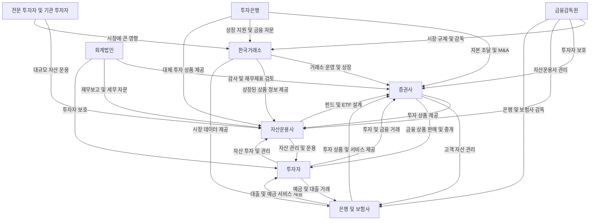

```mermaid
graph TD
    A[금융감독원] -->|시장 규제 및 감독| B[한국거래소]
    A -->|투자자 보호| C[증권사]
    A -->|자산운용사 관리| D[자산운용사]
    A -->|은행 및 보험사 감독| E[은행 및 보험사]

    B -->|거래소 운영 및 상장| C
    B -->|상장된 상품 정보 제공| D
    B -->|시장 데이터 제공| E

    C -->|투자 상품 제공| D
    C -->|고객 자산 관리| E
    C -->|금융 상품 판매 및 중개| F[투자자]

    D -->|자산 관리 및 운용| F
    D -->|펀드 및 ETF 설계| C

    E -->|대출 및 예금 서비스 제공| F
    E -->|투자 상품 및 서비스 제공| C

    F -->|투자 및 금융 거래| C
    F -->|자산 투자 및 관리| D
    F -->|예금 및 대출 거래| E

    G[투자은행] -->|자본 조달 및 M&A| C
    G -->|상장 지원 및 금융 자문| B
    G -->|대체 투자 상품 제공| D

    H[회계법인] -->|감사 및 재무제표 검토| C
    H -->|재무보고 및 세무 자문| D
    H -->|투자자 보호| F

    I[전문 투자자 및 기관 투자자] -->|대규모 자산 운용| D
    I -->|시장에 큰 영향| B
```