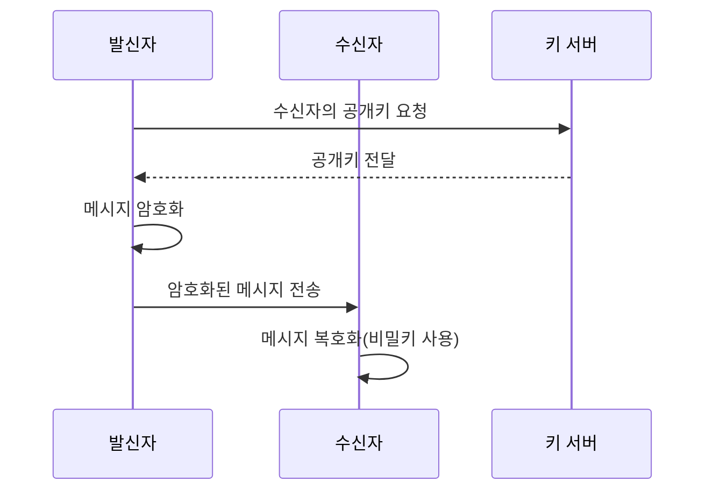
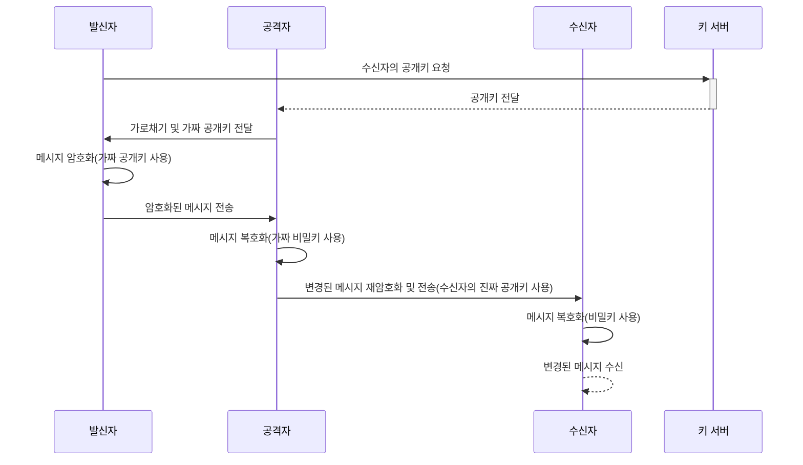
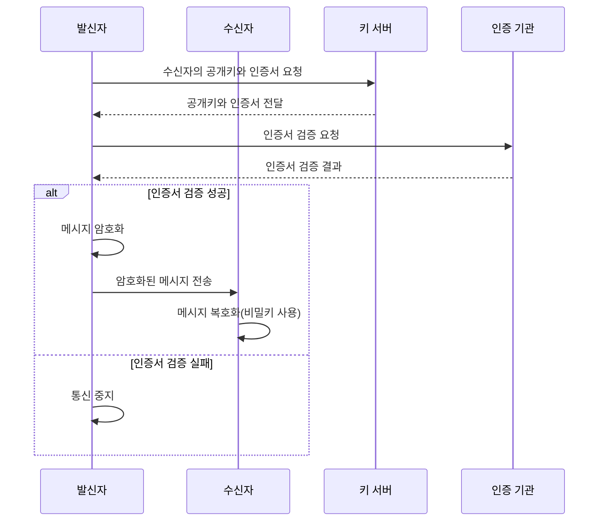
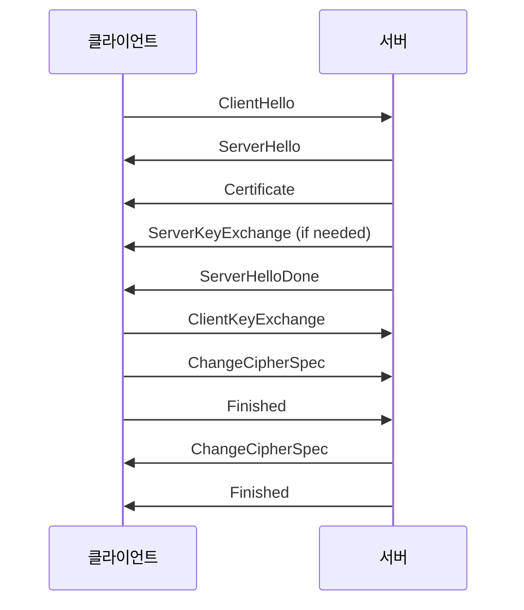

# TL ; DR

- 공개키 암호 방식에서는 공개키를 통한 암호화 과정이 필요하다. 이때 서버가 제공하는 공개키를 보증해주기 위한 프로세스로서 CA 인증서를 사용한다

# 공개키 암호 방식

1. **발신자**는 **수신자의 공개키**를 사용하여 메시지를 암호화합니다.
2. 암호화된 메시지는 수신자에게 전송됩니다.
3. **수신자**는 자신의 **비밀키**를 사용하여 메시지를 복호화합니다.

# Man In The Middle ( MITM ) 공격

1. **발신자**는 **수신자의 공개키**를 키 서버로부터 요청합니다.
2. 공격자가 이 요청을 가로채고, 발신자에게 가짜 공개키를 전송합니다.
3. 발신자는 이 가짜 공개키로 메시지를 암호화하고, 공격자에게 전송합니다.
4. 공격자는 가로챈 메시지를 자신의 비밀키로 복호화하고, 내용을 변경한 후 수신자의 진짜 공개키로 다시 암호화하여 수신자에게 전송합니다.
5. **수신자**는 메시지를 복호화하고 의도치 않게 변경된 메시지를 받습니다.

# **공개키 검증 절차**

1. **디지털 인증서 획득**: 사용자 또는 시스템은 상대방의 공개키가 포함된 디지털 인증서를 받습니다.
2. **CA의 신뢰성 확인**: CA가 신뢰할 수 있는지 확인합니다. 이는 일반적으로 운영 체제나 브라우저에 미리 설치된 신뢰할 수 있는 CA 목록을 통해 이루어집니다.
3. **인증서의 서명 검증**: CA의 공개키를 사용하여 인증서의 디지털 서명을 검증합니다. 이 과정에서 서명이 유효하다면 인증서 내의 정보가 CA에 의해 검증되었고 변경되지 않았음이 확인됩니다.
4. **인증서 유효성 확인**: 인증서의 유효 기간, 인증서 상태(취소 여부 등)를 확인합니다.
5. **공개키 사용**: 위의 검증 단계를 모두 통과한 공개키는 안전하게 통신에 사용될 수 있습니다.

# TLS & SSL

- TLS (Transport Layer Security)와 SSL (Secure Sockets Layer)은 인터넷 통신의 보안을 강화하기 위해 개발된 프로토콜
- 데이터의 기밀성과 무결성을 보장하고, 통신하는 양 당사자의 신원을 검증함으로써 안전한 인터넷 통신을 가능하게 함
- TLS **핵심 기능**
  1. **암호화**: 데이터를 암호화하여 네트워크를 통한 데이터 전송 시 기밀성을 유지합니다.
  2. **인증**: 디지털 인증서를 사용하여 서버 및 클라이언트의 신원을 확인합니다. 이는 주로 인증 기관(CA)에 의해 발행되는 인증서를 사용하여 이루어집니다.
  3. **데이터 무결성**: 메시지 인증 코드(MAC)를 사용하여 데이터가 전송 중에 변경되지 않았는지 확인합니다.

### **보안 연결 설정 과정**

- TLS 연결 설정 과정은 대략 다음과 같은 단계로 이루어집니다:
  1. **ClientHello**: 클라이언트가 서버로 연결을 초기화하고, 사용 가능한 암호화 방식, TLS 버전, 세션 ID 등을 서버에 전송합니다.
  2. **ServerHello**: 서버는 클라이언트의 ClientHello에 응답하여 선택된 암호화 알고리즘, 세션 ID, TLS 버전 등을 확정합니다.
  3. **Certificate**: 서버는 자신의 인증서를 클라이언트에게 전송합니다. 이 인증서에는 서버의 공개키가 포함되어 있습니다.
  4. **ServerKeyExchange** (필요한 경우): 일부 암호화 방식에서는 서버가 추가적인 키 교환 매개변수를 클라이언트에게 전송합니다.
  5. **ServerHelloDone**: 서버가 ClientHello 응답을 완료했음을 클라이언트에 알립니다.
  6. **ClientKeyExchange**: 클라이언트는 세션 키를 생성하고, 이를 서버의 공개키로 암호화하여 서버에 전송합니다.
  7. **ChangeCipherSpec**: 클라이언트와 서버는 메시지를 보내 이제부터 새로운 암호화 설정을 사용한다는 것을 알립니다.
  8. **Finished**: 클라이언트와 서버는 각각 핸드셰이크의 완성을 확인하는 메시지를 보냅니다.

## Ref

- https://shagihan.medium.com/what-is-certificate-chain-and-how-to-verify-them-be429a030887