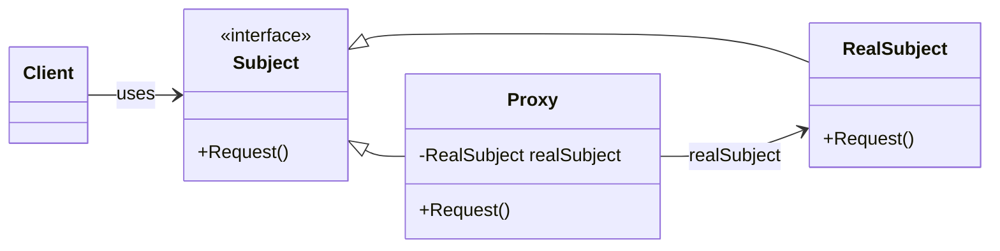
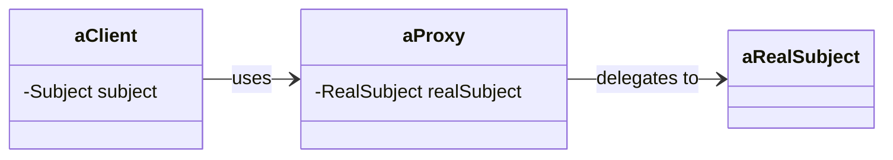

## TL;DR

- 프록시 패턴(Proxy Pattern)은 **객체에 대한 접근을 제어**하기 위해 대리자 역할을 하는 객체를 사용하는 디자인 패턴
- 프록시 객체는 실제 객체에 대한 접근을 캡슐화하여 클라이언트는 **프록시와 실제 객체의 차이를 인식하지 못하**도록 함.
- 이 패턴은 원격지 프록시, 가상 프록시, 보호용 프록시, 스마트 참조자 등 다양한 형태로 활용될 수 있음.

## 프록시 패턴의 의도

- 프록시 패턴은 다른 객체에 대한 접근을 제어하기 위해 대리자 또는 자리채움자 역할을 하는 객체를 둠.
- 클라이언트는 프록시 객체를 통해 실제 객체에 접근하며, 프록시가 실제 객체와 동일한 인터페이스를 제공하기 때문에, 프록시와 실제 객체의 차이를 인식하지 못함.

## 프록시 패턴의 활용성

- **원격지 프록시**: 원격 서버에 있는 객체를 로컬에서 대리하여 사용함. 로컬 환경에서 원격 객체를 접근할 수 있도록 해줌.
- **가상 프록시**: 고비용의 객체를 실제로 필요할 때까지 생성하지 않음. 실제 객체의 생성을 지연시켜 자원을 절약함.
- **보호용 프록시**: 객체에 대한 접근 권한을 제어함. 사용자가 특정 권한을 가지고 있는지 확인하여 접근을 제한함.
- **스마트 참조자**: 객체에 접근할 때 추가적인 행동을 수행함. 예를 들어 참조 횟수를 기록하거나 객체에 잠금을 거는 등의 작업을 수행함.

<details markdown="1">
<summary>구현 예시 Python</summary>

### 1. 원격지 프록시 (Remote Proxy)

- 원격지 프록시는 로컬에서 원격 서버에 있는 객체를 대리하여 사용
- Python에서 이와 같은 작업을 수행하기 위해서는 `xmlrpc.client`나 `socket` 모듈 등을 사용 가능

```python
import xmlrpc.client

# 원격 서버의 객체에 접근하는 프록시
class RemoteProxy:
    def __init__(self, server_url):
        self.server = xmlrpc.client.ServerProxy(server_url)

    def get_data(self):
        return self.server.get_data()

# 원격 서버에 접속
proxy = RemoteProxy("<http://example.com:8000>")
print(proxy.get_data())  # 원격 서버의 데이터를 가져옴
```

### 2. 가상 프록시 (Virtual Proxy)

- 가상 프록시는 고비용의 객체를 실제로 필요할 때까지 생성하지 않고 대리자 객체를 통해 작업을 처리

```python
class ExpensiveObject:
    def __init__(self):
        print("Expensive object created")
        self.data = "Some data"

    def get_data(self):
        return self.data

class VirtualProxy:
    def __init__(self):
        self._real_object = None

    def get_data(self):
        if self._real_object is None:
            self._real_object = ExpensiveObject()
        return self._real_object.get_data()

# 실제 객체는 처음 사용될 때 생성됨
proxy = VirtualProxy()
print(proxy.get_data())  # Expensive object created 이후에 데이터 반환

```

### 3. 보호용 프록시 (Protection Proxy)

보호용 프록시는 객체에 대한 접근을 제어하며, 접근 권한이 있는지 확인하는 로직을 포함

```python
class SensitiveObject:
    def __init__(self, secret_data):
        self._secret_data = secret_data

    def get_secret_data(self):
        return self._secret_data

class ProtectionProxy:
    def __init__(self, sensitive_object, user_role):
        self._sensitive_object = sensitive_object
        self._user_role = user_role

    def get_secret_data(self):
        if self._user_role == "admin":
            return self._sensitive_object.get_secret_data()
        else:
            raise PermissionError("Access Denied: You do not have permission to view this data")

# 사용자 권한에 따른 접근 제어
sensitive_data = SensitiveObject("Top Secret")
proxy = ProtectionProxy(sensitive_data, "user")

try:
    print(proxy.get_secret_data())  # 권한이 없으므로 에러 발생
except PermissionError as e:
    print(e)

```

### 4. 스마트 참조자 (Smart Reference)

- 스마트 참조자는 객체에 접근할 때 추가적인 행동을 수행
- 예를 들어, 참조 횟수를 기록하거나, 객체에 잠금을 거는 등의 작업

```python
class SmartReference:
    def __init__(self, real_object):
        self._real_object = real_object
        self._reference_count = 0

    def access(self):
        self._reference_count += 1
        return self._real_object.get_data()

    def release(self):
        self._reference_count -= 1
        if self._reference_count == 0:
            self._real_object = None  # 객체를 해제하는 로직

class RealObject:
    def get_data(self):
        return "Real object data"

# 스마트 참조자 사용 예시
real_object = RealObject()
smart_ref = SmartReference(real_object)

print(smart_ref.access())  # 참조 횟수 증가
smart_ref.release()        # 참조 횟수 감소, 필요시 객체 해제

```

</details>

## 프록시 패턴의 참여자



- **Proxy**: 실제 객체에 대한 참조자를 관리하고, 실제 객체의 생성과 삭제를 책임짐. 프록시의 종류에 따라 원격지 프록시, 가상 프록시, 보호용 프록시 등으로 나뉨.
- **Subject**: RealSubject와 Proxy가 공통으로 구현하는 인터페이스를 정의함. 이를 통해 클라이언트는 RealSubject 대신 Proxy를 사용할 수 있음.
- **RealSubject**: 프록시가 대리하는 실제 객체임. 클라이언트의 요청이 프록시를 통해 전달되며, 프록시는 RealSubject의 메서드를 호출함.



## 프록시 패턴의 결과

- 원격지 프록시는 객체가 다른 주소 공간에 존재한다는 사실을 숨길 수 있음.
- 가상 프록시는 실제 객체의 생성을 지연시켜 자원을 최적화할 수 있음.
- 보호용 프록시와 스마트 참조자는 객체에 접근할 때마다 추가적인 관리 작업을 수행할 수 있음. 예를 들어, 참조 횟수를 계산하거나, 객체의 잠금을 관리할 수 있음.

## 관련 패턴 비교

- **Adaptor vs Proxy**
    - Adaptor는 개조할 객체의 인터페이스와는 다른 인터페이스를 제공
    - 반면 Proxy는 자신이 상대하는 대상과 동일한 인터페이스를 제공
- **Decorator vs Proxy**
    - Decorator는 객체에 하나 이상의 서비스를 추가하기 위해 사용됨.
    - 반면 Proxy는 객체에 대한 접근을 제어하기 위해 사용됨.
