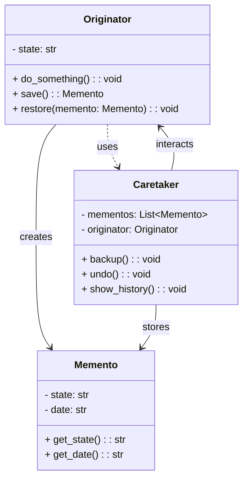

## TL;DR

- 메멘토는 스냅샷이라고도 불리며, 객체의 상태를 저장하는 역할을 수행함. 메멘토 객체는 직접 노출이 되지 않음에 유의
- 객체의 내부 상태를 캡슐화하여 외부에서 직접 접근할 수 없도록 하면서도, 이후 해당 상태를 복원할 수 있는 기능을 제공하는 패턴
- 사용자는 객체의 상태에 직접 접근할 필요 없이, Caretaker 객체가 노출하는 인터페이스를 통해 Originator 의 상태를 저장하고 복원할 수 있음

## 활용성

- 객체의 상태를 저장하고 복원해야 할 때, 특히 객체의 상태가 복잡하여 여러 단계를 거쳐 변경되는 경우
- 객체의 정보를 저장하고, 특정 시점으로 돌아가야 하는 기능을 구현할 때 (예: 실행 취소 기능)
- 객체의 내부 상태가 외부에 노출되지 않도록 보호하면서도, 상태를 이전 상태로 복원할 수 있어야 할 때

## 결과

- **장점**
    - **캡슐화 유지:** 객체의 상태를 외부에 노출하지 않으면서도 상태 복원이 가능함.
    - **실행 취소 기능 구현:** 메멘토 패턴을 통해 상태를 저장하고 복원할 수 있으므로, 실행 취소 기능을 쉽게 구현할 수 있음.
    - **복잡한 상태 관리:** 객체의 복잡한 상태를 관리하고, 이전 상태로 돌아갈 수 있음.

- **단점**
    - **메모리 사용:** 저장해야 하는 상태가 많거나 자주 변경될 경우, 메멘토 객체가 많이 생성되어 메모리 사용량이 증가할 수 있음.
    - **관리 복잡성:** 여러 시점의 상태를 관리해야 하므로, 메멘토 객체의 관리가 복잡해질 수 있음.

## 구현



- **Caretaker:** 상태를 저장하고 복원할 수 있도록 메멘토 객체를 관리하는 역할.
- **Originator:** 상태를 생성하고, 필요한 시점에 상태를 복원할 수 있는 역할.
- **Memento:** Originator의 상태를 저장하는 역할로, 내부 상태를 캡슐화하여 외부에서 접근할 수 없도록 보호함.

## 예시 - Simple Case

```python
from datetime import datetime

# 메멘토 클래스
class Memento:
    def __init__(self, state: str):
        self._state = state
        self._date = str(datetime.now())

    def get_state(self) -> str:
        return self._state

    def get_date(self) -> str:
        return self._date

# Originator 클래스
class Originator:
    def __init__(self, state: str):
        self._state = state

    def do_something(self):
        self._state = f"상태가 {self._state[::-1]}로 변경되었습니다."

    def save(self) -> Memento:
        return Memento(self._state)

    def restore(self, memento: Memento):
        self._state = memento.get_state()

# Caretaker 클래스
class Caretaker:
    def __init__(self, originator: Originator):
        self._mementos = []
        self._originator = originator

    def backup(self):
        print(f"Caretaker: 상태 저장")
        self._mementos.append(self._originator.save())

    def undo(self):
        if not self._mementos:
            return

        memento = self._mementos.pop()
        print(f"Caretaker: 상태 복원 -> {memento.get_date()}")
        self._originator.restore(memento)

    def show_history(self):
        print("Caretaker: 저장된 상태 목록:")
        for memento in self._mementos:
            print(memento.get_date(), "-", memento.get_state())

# 사용 예시
if __name__ == "__main__":
    originator = Originator("초기 상태")
    caretaker = Caretaker(originator)

    caretaker.backup()
    originator.do_something()

    caretaker.backup()
    originator.do_something()

    caretaker.backup()
    originator.do_something()

    caretaker.show_history()

    caretaker.undo()
    caretaker.undo()
```

## 예시 - CareTaker 가 복수개라서, Originator 의 상태 동기화가 필요한 경우

- 옵저버 패턴을 사용한다.
- Originator 가 Subject ( = Observable ) 이 되고, Caretaker 가 Observer 가 된다.

```python
class Originator:
    def __init__(self, state: str):
        self._state = state
        self._observers = []

    def do_something(self):
        self._state = f"상태가 {self._state[::-1]}로 변경되었습니다."
        self._notify()

    def save(self):
        return self.Memento(self._state)

    def restore(self, memento):
        self._state = memento.get_state()
        self._notify()

    def attach(self, observer):
        self._observers.append(observer)

    def _notify(self):
        for observer in self._observers:
            observer.update(self)

    def show_state(self):
        print(f"현재 상태: {self._state}")

    class Memento:
        def __init__(self, state: str):
            self._state = state

        def get_state(self):
            return self._state


class Caretaker:
    def __init__(self, originator: Originator):
        self._mementos = []
        self._originator = originator
        originator.attach(self)

    def backup(self):
        print("Caretaker: 상태를 저장합니다.")
        self._mementos.append(self._originator.save())

    def undo(self):
        if not self._mementos:
            return

        memento = self._mementos.pop()
        print("Caretaker: 상태를 복원합니다.")
        self._originator.restore(memento)

    def update(self, originator: Originator):
        print("Caretaker: Originator의 상태가 변경되었습니다.")
        self.backup()


if __name__ == "__main__":
    originator = Originator("초기 상태")
    caretaker1 = Caretaker(originator)
    caretaker2 = Caretaker(originator)

    originator.show_state()
    originator.do_something()

    caretaker1.undo()
    originator.show_state()

    caretaker2.undo()
    originator.show_state()
```

## 요약

메멘토 패턴은 객체의 상태를 저장하고 복원할 수 있는 기능을 제공하는 패턴입니다. 이 패턴을 사용하면, 객체의 내부 상태를 외부에 노출하지 않으면서도, 과거의 상태로 복원할 수 있습니다. 주로 실행 취소 기능이나 복잡한 상태 관리가 필요한 시스템에서 유용하게 사용됩니다.
