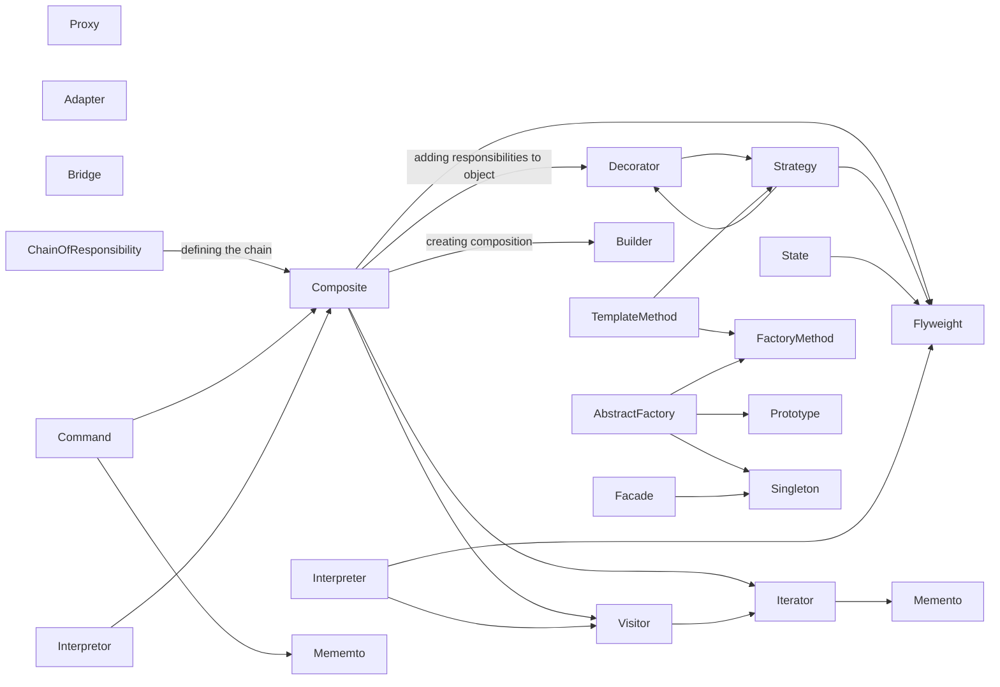

```mermaid

graph LR
    Proxy
    Adapter
    Bridge

    Composite --adding responsibilities to object--> Decorator
    Composite --> Visitor
    Composite --> Iterator
    Composite --creating composition--> Builder
    Composite --> Flyweight

    ChainOfResponsibility --defining the chain--> Composite

    Strategy --> Flyweight
    State --> Flyweight
    Interpreter --> Flyweight

    Command --> Mememto
    Command --> Composite

    Visitor --> Iterator
    Iterator --> Memento

    Interpreter --> Visitor
    Interpretor --> Composite

    Decorator --> Strategy
    Strategy --> Decorator
    TemplateMethod --> Strategy
    TemplateMethod --> FactoryMethod

    AbstractFactory --> FactoryMethod
    AbstractFactory --> Prototype
    AbstractFactory --> Singleton
    Facade --> Singleton

```
