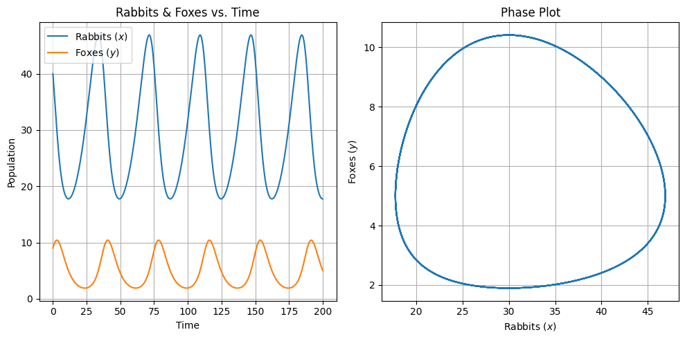

# 순환하는 것들에 대한 생각

- 세상은 순환하는 현상으로 가득 차 있습니다.
- 그 중에서도 자연에서의 포식자와 피식자의 관계는 뚜렷한 순환현상을 보여주는 좋은 예입니다.
- 이러한 현상을 수학적으로 모델링하여 설명하는 방법 중 하나가 Lotka-Volterra 방정식입니다.
- 본 글에서는 이 방정식의 기본 개념과 그 의미를 소개하며, 이를 통해 순환현상을 어떻게 설명할 수 있는지 알아보겠습니다.
- 또한, 이와 비슷한 순환현상이 경제학에서도 나타나며, 이를 어떻게 해석할 수 있는지에 대한 고찰도 함께 진행하겠습니다.

## Lotka-Volterra 방정식

- 이 모델은 다음 두 개의 미분방정식으로 표현됩니다:

1. $\frac{dx}{dt} = \alpha x - \beta x y$
2. $\frac{dy}{dt} = -\gamma y + \delta x y$

- 여기서

    - $x(t)$는 시간 $t$에서의 토끼의 개체 수를 나타냅니다.
    - $y(t)$는 시간 $t$에서의 여우의 개체 수를 나타냅니다.
    - $\alpha$는 토끼의 출산율을 나타냅니다.
    - $\beta$는 여우에게 잡아먹힐 확률을 나타냅니다.
    - $\gamma$는 여우의 자연사멸률을 나타냅니다.
    - $\delta$는 여우가 토끼를 잡아먹을 때 얻는 영양분을 나타냅니다.

- Lotka-Volterra 방정식은 포식자와 피식자의 숫자 변동을 미분방정식을 통해 설명합니다.
- 간단히 말해, 피식자의 숫자가 많아지면 포식자의 숫자도 증가하며, 포식자의 숫자가 증가하면 피식자의 숫자는 감소하는 것을 수학적으로 표현한 것입니다. ( xy 항이 서로의 상호작용을 모델링 합니다. )

## 순환현상의 설명

- Lotka-Volterra 방정식의 해결을 통해, 포식자와 피식자의 숫자는 주기적으로 증감하는 현상을 볼 수 있습니다.
- 이는 실제 자연에서도 관측되는 현상으로, 순환의 원인과 그 특징에 대해 깊게 이해할 수 있게 해줍니다.



## 경제학에서의 순환현상

- 경제학에서도 비슷한 순환현상을 볼 수 있습니다. 경제의 호황과 불황은 마치 포식자와 피식자의 숫자 변동과 유사한 패턴을 보입니다.
- 이를 Lotka-Volterra 방정식의 관점에서 해석하면, 경제의 다양한 요소와 그 상호작용을 더 깊게 이해할 수 있습니다.

## 경제 주체 간의 관계 해석

- 여우와 토끼의 관계와 비슷하게, 경제에서의 다양한 경제 주체 사이의 관계도 Lotka-Volterra 방정식을 통해 해석할 수 있습니다.

1. 시장의 공급자와 수요자 관계

    - 피식자(population of prey)가 경제에서의 제품 또는 서비스의 수요를 나타내고, 포식자(population of predators)가 제품 또는 서비스의 공급을 나타낸다고 가정해 보겠습니다.
    - 수요가 증가하면 공급자(제조업체 또는 서비스 제공자)의 이익과 숫자도 증가하게 됩니다.
    - 반대로 공급이 너무 많아지면 가격 경쟁으로 인해 일부 공급자가 시장에서 탈락하게 되고, 이로 인해 공급이 줄어들게 됩니다.

2. 경쟁 회사 간의 상호작용

    - 두 회사가 동일한 시장에서 경쟁하고 있다고 가정합니다. 한 회사의 성공은 다른 회사의 시장 점유율 감소로 이어질 수 있습니다.
    - 이러한 경쟁 상황에서 각 회사의 전략은 다른 회사의 전략에 따라 지속적으로 조정되며, 이는 Lotka-Volterra 방정식의 포식자-피식자 모델과 유사한 현상을 보여줄 수 있습니다.

3. 금융 시장에서의 투자와 대출
    - 투자자와 대출기관 간의 상호작용도 포식자-피식자 모델로 해석될 수 있습니다.
    - 대출금리가 낮아지면 투자가 증가하며, 대출량도 증가합니다. 그러나 과도한 대출은 빚의 부담을 증가시켜 결국 투자를 감소시킬 수 있습니다.

## Goodwin의 모델

- 사이클 현상을 설명하는 경제학 모델 중 하나입니다.
- 노동과 자본 간의 상호작용을 통해 경제에서의 주기적인 현상을 설명하려고 했습니다.
- 주로 자본주의 경제에서의 임금과 고용의 주기적인 흐름을 보여줄 수 있습니다.
- Goodwin 모델은 다음의 두 미분방정식을 포함합니다:
- Lotka-Volterra 의 형태와 거의 유사함을 알 수 있습니다.

1. $\frac{dN}{dt} = rN - \phi(N)W$
2. $\frac{dW}{dt} = -hW + \psi(N)W$

- 여기서

    - $N$은 고용률을 나타냅니다.
    - $W$은 실제 임금을 나타냅니다.
    - $r$은 자연적인 인구 증가율입니다.
    - $\phi(N)$는 생산률 함수로, 일반적으로 $N$의 증가 함수로 가정됩니다.
    - $h$는 임금 증가율을 나타냅니다.
    - $\psi(N)$는 임금 설정 함수로, 일반적으로 $N$의 감소 함수로 가정됩니다.

- 이 모델의 핵심은 임금과 고용의 상호작용입니다. 특히, 고용률이 증가하면 임금은 더 빠르게 증가하고, 임금이 너무 빠르게 오르면 기업은 노동자를 채용하는 것을 줄이게 되어 고용률이 감소하게 됩니다.

## 생각

- Lotka-Volterra 방정식은 자연의 순환현상을 이해하는 데 중요한 도구입니다. 그리고 이러한 방정식의 원리를 경제학에도 적용함으로써, 우리는 경제의 복잡한 현상을 더 깊게 이해하고 분석할 수 있게 됩니다.
- 이를 통해 상호 작용하는 두 주체 간의 영향에 따른 순환 현상을 이해할 수 있게 됩니다.

## 파이썬 코드

```python
import numpy as np
from scipy.integrate import odeint
import matplotlib.pyplot as plt

# Lotka-Volterra equations
def lotka_volterra(state, t, alpha, beta, gamma, delta):
    x, y = state
    dx = alpha*x - beta*x*y
    dy = -gamma*y + delta*x*y
    return [dx, dy]

# Parameters
alpha = 0.1
beta = 0.02
gamma = 0.3
delta = 0.01

# Initial conditions: 40 rabbits and 9 foxes
initial_state = [40, 9]

# Time grid
t = np.linspace(0, 200, 1000)

# Solve differential equation
solution = odeint(lotka_volterra, initial_state, t, args=(alpha, beta, gamma, delta))

# Plot
plt.figure(figsize=(10,5))
plt.subplot(1, 2, 1)
plt.plot(t, solution[:, 0], label="Rabbits ($x$)")
plt.plot(t, solution[:, 1], label="Foxes ($y$)")
plt.legend()
plt.title("Rabbits & Foxes vs. Time")
plt.xlabel("Time")
plt.ylabel("Population")
plt.grid(True)

plt.subplot(1, 2, 2)
plt.plot(solution[:, 0], solution[:, 1])
plt.title("Phase Plot")
plt.xlabel("Rabbits ($x$)")
plt.ylabel("Foxes ($y$)")
plt.grid(True)

plt.tight_layout()
plt.show()
```
