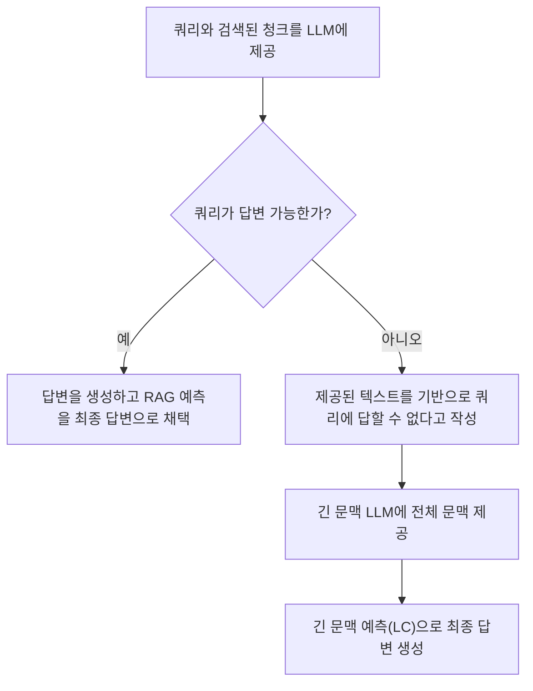
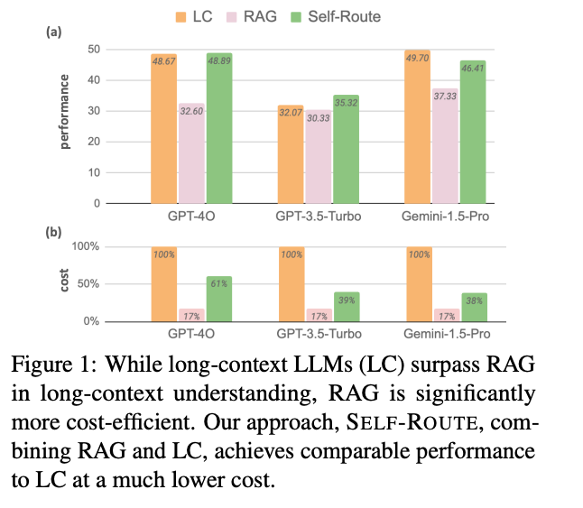
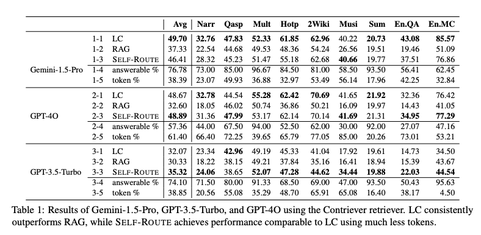
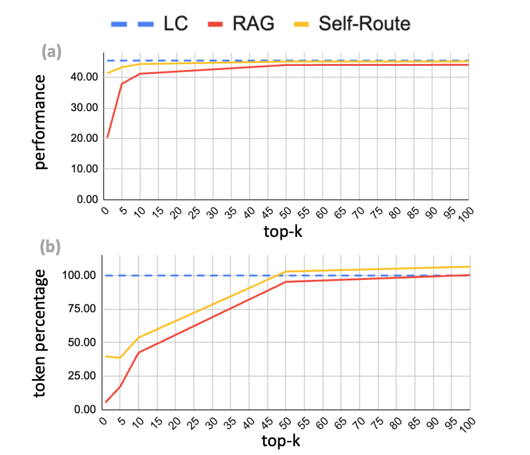

# Retrieval Augmented Generation or Long-Context LLMs? - A Comprehensive Study and Hybrid Approach

## Origin

- <https://arxiv.org/pdf/2407.16833>

## Insight

- **Self Route 기법을 이용해서, RAG 와 LC 방법론을 조합하면 성능을 유지하면서 비용을 낮출 수 있다.**

## Abstract

1. RAG ( Retrieval Augmented Generation ) 는 LLM 이 긴 문맥을 효과적으로 처리할 수 있는 강력한 도구
2. 최근 Gemini 1.5 및 GPT-4 는 Long Context ( LC ) 를 지원하면서 긴 문맥을 직접 처리할 수 있게 됨
3. RAG 와 LC 를 다양한 공개 데이터 세트에서 벤치마크 해보면, 충분한 자원이 주어질 때 LC 의 성능이 좋음
4. LC 는 자원을 더 소모하기 때문에 비쌈.
5. SELF ROUTE 라는 새로운 방식을 소개함.
6. SELF ROUTE 는 LC 와 RAG 의 장점을 취하여 성능은 유지시키되, 비용은 낮음
7. SELF ROUTE 를 통해서 긴 문맥에 대한 처리 방법론을 제안

## Problem

*- What did author try to acommplish ?*

1. RAG 는 싸지만 성능이 좀 떨어지고
2. LC 는 성능이 좋지만 비쌈
3. 성능을 유지하면서 싸게 할 방법이 없을까 ?

## Contribution

*- What were the key elements of the approach ?*

1. LLM 을 통해서 Retrieval 된 정보 ( 쿼리된 정보 ) 에서 답변이 가능한지 아닌지를 LLM 을 통해서 체크함.
2. LLM 이 쿼리된 정보로 부터 답변 가능하다고 판단하면 쿼리된 정보를 가지고 생성함 ( RAG )
3. LLM 이 쿼리된 정보로 부터 답볍 불가능하다고 판단하면 LC 를 주입해서 답변을 생성함

## Others

1. 평가 지표로는 개방형 QA 작업의 경우 F1 점수를, 다중 선택형 QA 작업의 경우 정확도를, 요약 작업의 경우 ROUGE 점수 사용
2. 연구에서는 Retrievers 알고리즘으로 두 가지를 사용했다고 함.
    1. Contriever (Izacard et al., 2021) - a contrastively trained dense retriever
    2. Dragon (Lin et al., 2023) is a recent generalizable dense retriever achieving high performance in both supervised and zero-shot settings without complex late interaction
3. RAG 에서 retrieve 되는 개수에 따라서 성능이 높아지는데, 토큰 소모량도 많아지기 때문에 적절한 수준에서 k를 결정해서 사용해야함. 논문에서는 경험적으로 k = 5 가 좋았다고 한다. 그것 보다 많이 Retrieve 하면 토큰 사용량이 늘어나서, 효율성 떨어짐

    

