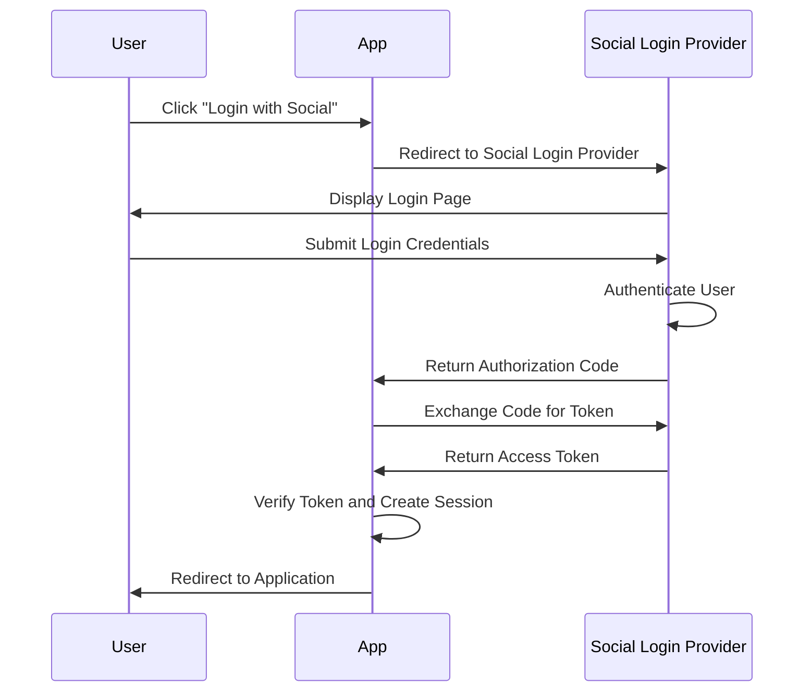
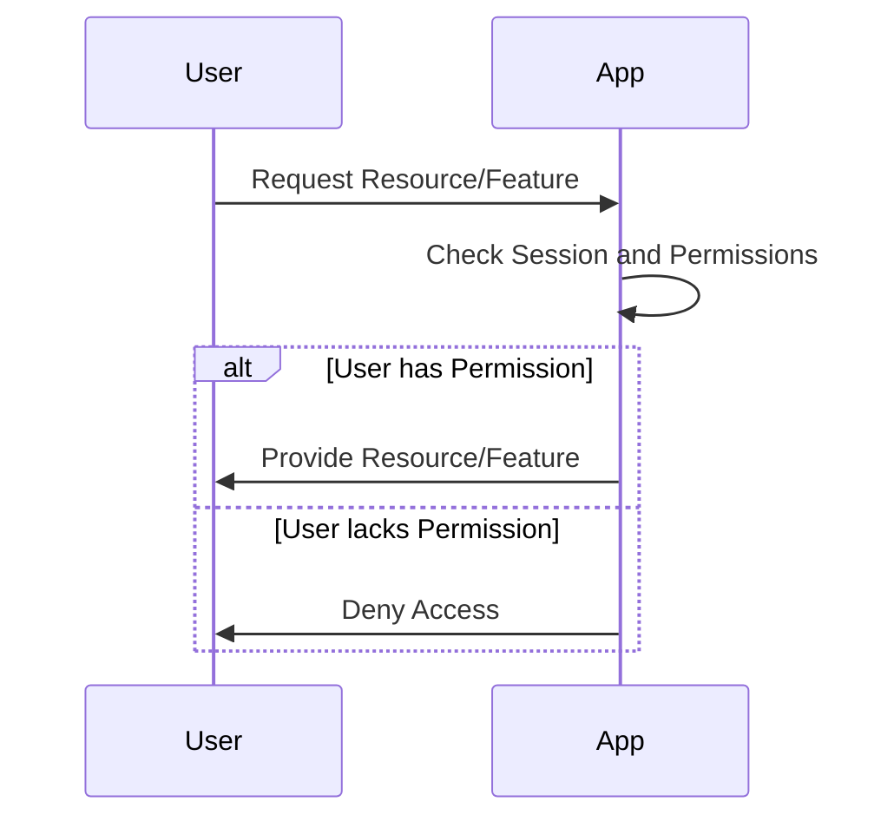
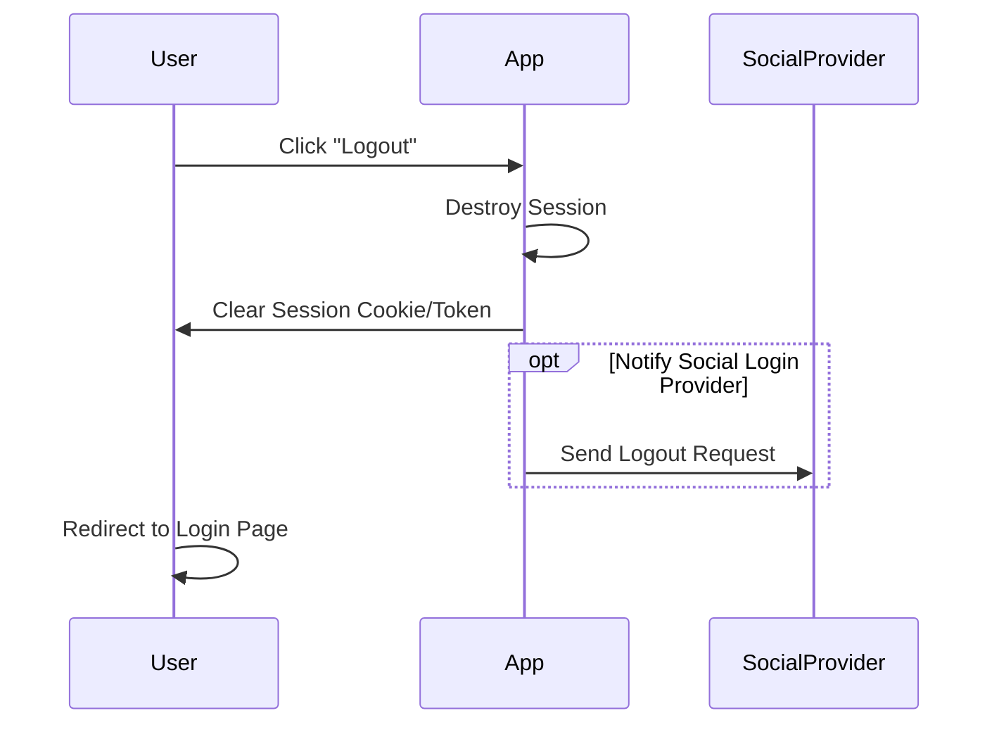
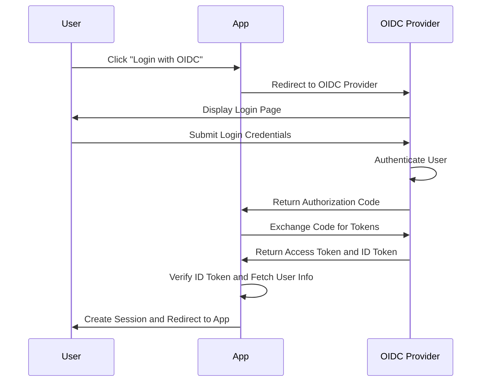

# Social Login

## Oauth 2.0

- <https://datatracker.ietf.org/doc/html/rfc6749>
- **OAuth 2.0**은 주로 권한 부여를 위해 설계된 프로토콜로, 보호된 리소스에 접근하는 데 사용됩니다.
    - 액세스 토큰만을 사용하여 보호된 리소스에 접근합니다.
    - 제3자 애플리케이션이 사용자 대신 리소스 서버에 접근할 수 있도록 허용합니다.
    - 사용자 인증 기능이 직접적으로 포함되지 않으므로, 사용자 정보를 가져오기 위해 추가적인 API 호출이 필요합니다.

### 1. 사용자 로그인 (Authentication)

- 사용자 소셜 로그인 클릭: 사용자가 애플리케이션에서 소셜 로그인 버튼을 클릭합니다.
- 소셜 로그인 제공자로 리다이렉션: 사용자는 소셜 로그인 제공자(예: Google, Facebook)의 로그인 페이지로 리다이렉션됩니다.
- 사용자 인증: 사용자가 소셜 로그인 제공자에게 로그인 자격 증명을 제출합니다.
- Authorization Code 수신: 소셜 로그인 제공자가 애플리케이션 서버로 Authorization Code를 반환합니다.
- Access Token 교환: 애플리케이션 서버가 Authorization Code를 Access Token으로 교환합니다.
- Access Token 검증: 애플리케이션 서버가 Access Token을 검증하고 사용자 정보를 가져옵니다.
- 세션 생성: 애플리케이션 서버가 검증된 사용자 정보를 기반으로 사용자 세션을 생성합니다.



- Authorization Code: 사용자가 소셜 로그인 제공자(예: Google, Facebook)에게 성공적으로 로그인하면, 제공자는 애플리케이션 서버에 Authorization Code를 반환합니다. 이 코드는 일회용이며 짧은 시간 동안만 유효합니다.

- Authorization Code 교환: 애플리케이션 서버는 이 Authorization Code를 사용하여 소셜 로그인 제공자에게 Access Token을 요청합니다. 이 요청은 애플리케이션의 클라이언트 ID와 시크릿을 포함하여 인증되며, 이는 클라이언트가 합법적인 애플리케이션인지 확인하는 데 사용됩니다.

- Access Token 발급: 소셜 로그인 제공자는 요청을 검증한 후 Access Token을 반환합니다. 이 토큰은 애플리케이션이 소셜 로그인 제공자의 API에 접근하는 데 사용됩니다.

### 2. 서비스 이용 (Authorization)



- 세션 유지: 사용자가 애플리케이션을 사용하는 동안, 세션 쿠키 또는 토큰을 통해 지속적으로 인증된 상태를 유지합니다.
- 권한 확인: 사용자가 특정 기능이나 리소스에 접근하려고 할 때마다, 애플리케이션 서버는 사용자의 권한을 확인합니다. 이는 사용자 프로필의 역할(Role)이나 권한(Permissions)을 통해 결정됩니다.
- 서비스 제공: 사용자가 권한을 가지고 있는 경우, 요청한 기능이나 리소스에 접근할 수 있습니다. 그렇지 않은 경우, 접근이 거부됩니다.

### 3. 서비스 종료 (Logout)



- 사용자 로그아웃 클릭: 사용자가 애플리케이션에서 로그아웃 버튼을 클릭합니다.
- 세션 종료: 애플리케이션 서버가 사용자의 세션을 종료하고, 클라이언트 측의 세션 쿠키 또는 토큰을 삭제합니다.
- 소셜 로그인 제공자 로그아웃 (옵션): 필요에 따라, 애플리케이션은 소셜 로그인 제공자에게도 로그아웃 요청을 보낼 수 있습니다.

## OIDC (OpenID Connect)

- <https://openid.net/specs/openid-connect-core-1_0.html>
- **OpenID Connect** (OIDC)는 OAuth 2.0을 기반으로 한 인증 프로토콜로, 사용자의 신원을 확인하는 데 사용됩니다.
    - 액세스 토큰과 함께 ID 토큰을 사용하여 사용자의 신원을 확인합니다.
    - OIDC를 통해 애플리케이션은 사용자 인증과 권한 부여를 모두 처리할 수 있습니다.
- OAuth 2.0만을 사용하는 경우, 애플리케이션은 액세스 토큰을 통해 보호된 리소스에 접근하지만, 사용자 인증과 관련된 정보를 얻기 위해 추가적인 단계를 거쳐야 합니다. OIDC는 이러한 과정을 단순화하여 사용자 인증을 보다 쉽게 구현할 수 있도록 합니다.



## Flask Example - OIDC

```python
@app.route('/login')
def login():
    oidc_auth_url = 'https://accounts.google.com/o/oauth2/auth'
    client_id = 'YOUR_CLIENT_ID'
    redirect_uri = url_for('login_callback', _external=True)
    scope = 'openid email profile'
    return redirect(f'{oidc_auth_url}?response_type=code&client_id={client_id}&redirect_uri={redirect_uri}&scope={scope}')

```

- 사용자가 로그인 버튼을 클릭하면, Flask 애플리케이션은 Google OAuth 2.0 인증 URL로 리다이렉션됩니다.
- 사용자가 Google 로그인 페이지에서 로그인하면, Google은 Authorization Code를 생성하고 애플리케이션 서버로 리다이렉션합니다.

```python
@app.route('/login/callback')
def login_callback():
    code = request.args.get('code')
    token_url = 'https://oauth2.googleapis.com/token'
    client_id = 'YOUR_CLIENT_ID'
    client_secret = 'YOUR_CLIENT_SECRET'
    redirect_uri = url_for('login_callback', _external=True)
    data = {
        'code': code,
        'client_id': client_id,
        'client_secret': client_secret,
        'redirect_uri': redirect_uri,
        'grant_type': 'authorization_code'
    }
    response = requests.post(token_url, data=data)
    token_response = response.json()
    id_token = token_response.get('id_token')
    access_token = token_response.get('access_token')

    # ID Token 검증 및 디코딩
    user_info = jwt.decode(id_token, options={"verify_signature": False})

    # 세션에 사용자 정보 저장
    session['user'] = {
        'id': user_info['sub'],
        'name': user_info['name'],
        'email': user_info['email'],
        'picture': user_info['picture']
    }

    return redirect(url_for('profile'))
```

- 애플리케이션 서버는 Authorization Code를 사용하여 Google OAuth 2.0 토큰 엔드포인트로 POST 요청을 보냅니다.
- Google은 애플리케이션 서버에 Access Token과 ID Token을 반환합니다.
- ID Token은 JWT 형식으로 인코딩되어 있으며, 애플리케이션 서버에서 검증 및 디코딩하여 사용자 정보를 추출합니다.
- 사용자 정보를 세션에 저장하고, 프로필 페이지로 리다이렉션합니다.

```python
@app.route('/profile')
def profile():
    user = session.get('user')
    if not user:
        return redirect(url_for('login'))
    return f"""
    <h1>Welcome {user['name']}</h1>
    
    <p>Email: {user['email']}</p>
    <a href="/logout">Logout</a>
    """

@app.route('/logout')
def logout():
    session.pop('user', None)
    return redirect(url_for('login'))
```

- 프로필 페이지에서 사용자 정보를 표시하고, 로그아웃 버튼을 제공합니다.
- 로그아웃 버튼을 클릭하면, 세션에서 사용자 정보를 삭제하고 로그인 페이지로 리다이렉션합니다.

## References

- <https://realpython.com/flask-google-login/>
