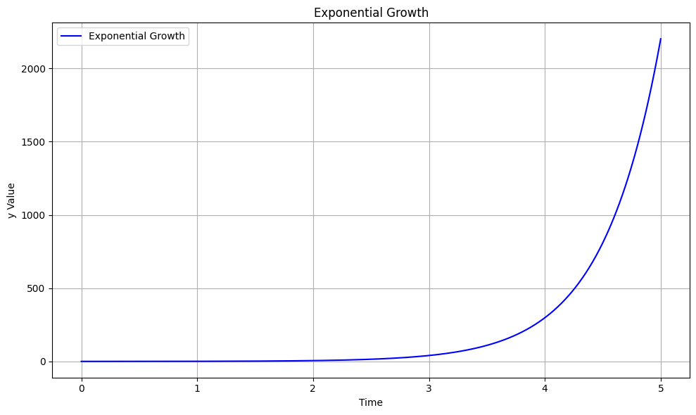
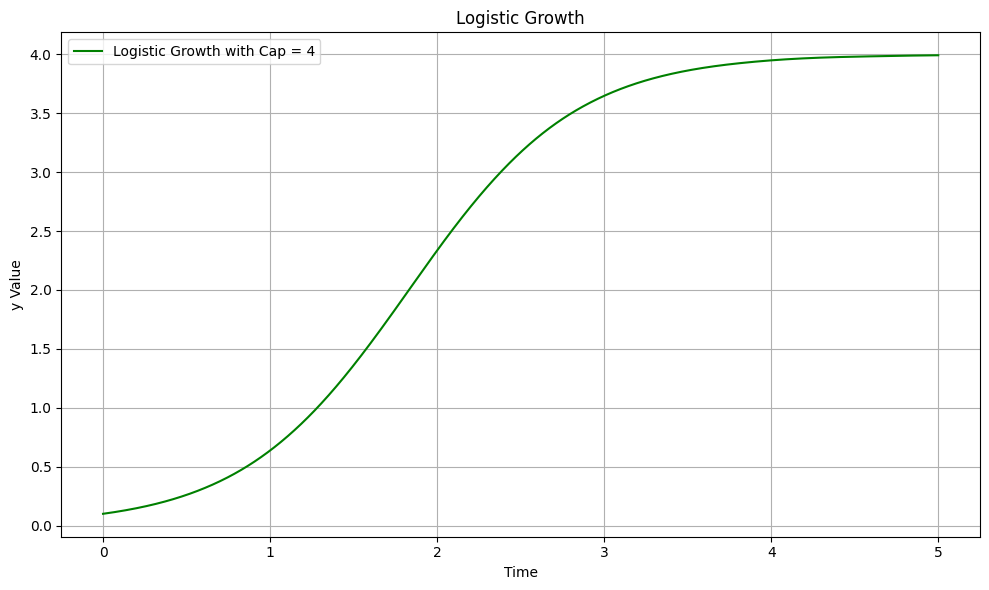
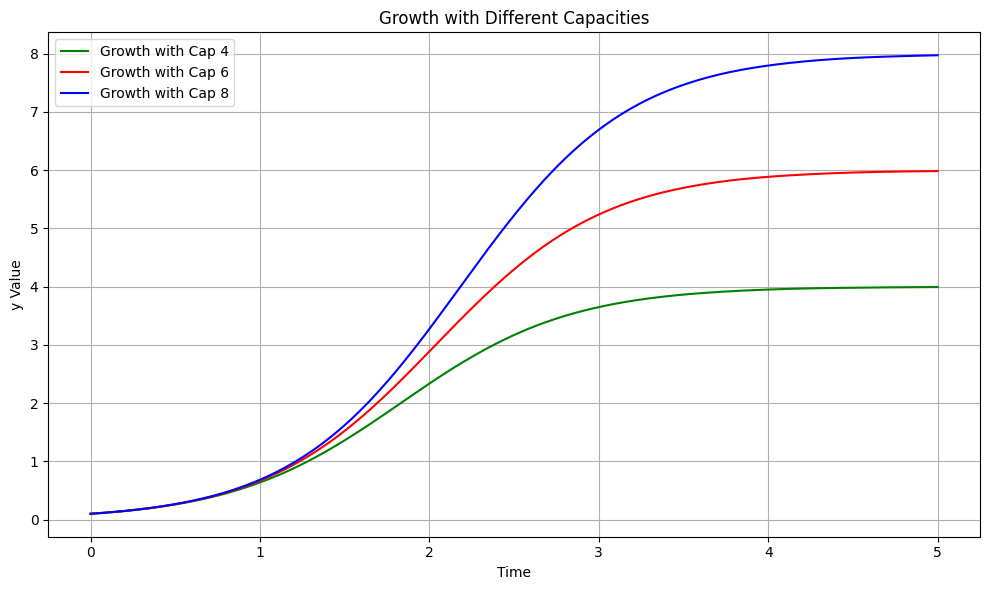

### 학습한 것이 쌓여감에 따라 지속적으로 성장하는 사람이 된다.

- 샘 알트만은 [성공하는 방법](https://blog.samaltman.com/how-to-be-successful)에서 Compound Yourself 라는 이야기를 했다. 
- 복리의 마법을 누리라는 것인데, 선형적인 성장을 넘어서 지수적인 성장을 추구하라는 의미.


**지수적 성장**

- 지수적 성장은 어떤 것이 일정한 비율로 계속해서 늘어나는 성장 패턴을 말한다. 
- 수학적으로는 $y = e^t$ 의 형태이고 이것은 $dy/dt = a \times y$의 형태의 미분방정식의 해이다. 
- 미분 방정식을 해석해보면 다음 시점의 성장이 현재 성장한 양에 비례해서 성장할 때 지수적 성장이 이뤄진다는 뜻



**자연 현상에서의 지수적 성장**  

- 이러한 지수적 성장은 자연에서도 자주 관찰되는데, 박테리아의 배양 과정에서, 충분한 양의 자원이 주어질 경우 박테리아는 빠르게 늘어나게 된다.
- 이 때 박테리아의 성장은 dy/dt = ax 형태로 모델링 될 수 있는데, 이 미분방정식의 해는 y = e^ax 꼴로 지수적인 성장을 나타낸다. 
- 실제 자연계에서는 무한한 지수적 성장은 없음
- 실제 환경에서는 자원의 한계, 경쟁, 포식자 등 여러 요인으로 인해 성장 속도가 줄어들게 된다. 이러한 현상은 \(dy/dt = ax - f(x)\)의 형태로 모델링 될 수 있으며, \(f(x)\)는 성장에 대한 저항 요소를 의미한다.

**인간의 기억력과 지수적 성장**   

- 기본적으로 성장은 지식과 경험의 축적량으로 결정. 
- 인류의 문명이 비약적으로 발전한 것도 문자를 통해서 지식이 축적되었기 때문
- 현실에서의 박테리아의 증식 예시와 동일한 논리로 인간의 성장에는 한계가 있다. 
- 가장 큰 제약조건은 망각이라고 생각함 -> 우리는 새로운 정보를 지속적으로 습득하면서 성장하지만, 기억력의 한계로 인해 일부 정보는 잊혀짐
- 이러한 기억력의 한계는 로지스틱 성장 모델인 $dy/dt = a \times y \times (1 - (y/\text{capacity}))$로 모델링 될 수 있음. 여기서 capacity는 우리의 기억력의 최대 용량을 의미
- dy/dt ( = 성장 속도 ) 가 기억 용량의 한계 도달하면 더 이상의 성장은 할 수 없게 됨. 해당 미분 방정식의 해를 그려보면 -> capacity 에 의해서 성장량이 제한되는 것을 확인할 수 있음 




- 메모나 기록을 통해 이러한 기억력의 한계를 극복할 수 있게 만드는 주요한 도구. 기록을 통해 우리는 정보를 더 효과적으로 저장하고, 잊혀지는 것을 방지할 수 있음. 이는 마치 우리의 기억력의 'capacity'를 늘리거나 심지어 무한대로 확장하는 것과 같음.
- capacity 가 무한대로 확장하거나 매우 높아진다면 $dy/dt = a \times y \times ( 1 - 0) = a \times y$ 형태로 성장 속도가 변화하여, 지수적인 성장이 가능하게 된다.
- capacity 를 늘리면 "지수적인 성장과 근사하는 수준의 성장을 하는 구간"이 늘어난다는 것. 망각은 성장에 있어서 가장 큰 적이고, 이것을 효과적으로 대응하는 것이 중요



**결론**   

- 지수적 성장의 원리는 자연계, 그리고 우리의 생활에서도 흔히 볼 수 있음. 인간의 기억력 역시 그 성장에 한계가 있지만, 기록과 정보의 구조화를 통해 이러한 한계를 극복하고 지속적인 성장을 추구할 수 있음.
- 그러나 기록 등을 통해서 인간의 한계를 극복하기 위한 전략없이는 무한한 지수적 성장은 불가능
- 학습한 것이 쌓여감에 따라 지속적으로 성장하는 사람이 되기 위해서 효과적인 망각 대응 전략을 세워야 한다는 결론 -> 기록, 정보 구조화, 복습 등

```python
import numpy as np
from scipy.integrate import solve_ivp
import matplotlib.pyplot as plt

# 지수적 성장 미분 방정식
def exponential_growth(t, y, a):
    return a * y

# 지수적 성장에 저항 요인이 추가된 미분 방정식
def growth_with_resistance(t, y, a, cap):
    return a * y * (1 - (y / cap))

# 초기 조건
y0 = [0.1]

# 시간 범위 설정
t_span = (0, 5)
t = np.linspace(*t_span, 1000)

# a 값 설정
a = 2.0
cap_1 = 4
cap_2 = 6
cap_3 = 8

# 미분 방정식 풀이
sol_exp = solve_ivp(exponential_growth, t_span, y0, t_eval=t, args=(a,))
sol_log = solve_ivp(growth_with_resistance, t_span, y0, t_eval=t, args=(a, cap_1))
sol2 = solve_ivp(growth_with_resistance, t_span, y0, t_eval=t, args=(a, cap_1))
sol3 = solve_ivp(growth_with_resistance, t_span, y0, t_eval=t, args=(a, cap_2))
sol4 = solve_ivp(growth_with_resistance, t_span, y0, t_eval=t, args=(a, cap_3))

# 1번 그림: 지수적 성장 그래프
fig1, ax1 = plt.subplots(figsize=(10, 6))
ax1.plot(sol_exp.t, sol_exp.y[0], label="Exponential Growth", color='b')
ax1.set_title("Exponential Growth")
ax1.set_xlabel("Time")
ax1.set_ylabel("y Value")
ax1.legend()
ax1.grid(True)
plt.tight_layout()
plt.show()

# 2번 그림: 로지스틱 성장의 전형적인 개형 그래프
fig2, ax2 = plt.subplots(figsize=(10, 6))
ax2.plot(sol_log.t, sol_log.y[0], label="Logistic Growth with Cap = {}".format(cap_1), color='g')
ax2.set_title("Logistic Growth")
ax2.set_xlabel("Time")
ax2.set_ylabel("y Value")
ax2.legend()
ax2.grid(True)
plt.tight_layout()
plt.show()

# 3번 그림: 다양한 cap 값에 따른 로지스틱 성장 그래프
fig3, ax3 = plt.subplots(figsize=(10, 6))
ax3.plot(sol2.t, sol2.y[0], label=f"Growth with Cap {cap_1}", color='g')
ax3.plot(sol3.t, sol3.y[0], label=f"Growth with Cap {cap_2}", color='r')
ax3.plot(sol4.t, sol4.y[0], label=f"Growth with Cap {cap_3}", color='b')
ax3.set_title("Growth with Different Capacities")
ax3.set_xlabel("Time")
ax3.set_ylabel("y Value")
ax3.legend()
ax3.grid(True)
plt.tight_layout()
plt.show()
```
