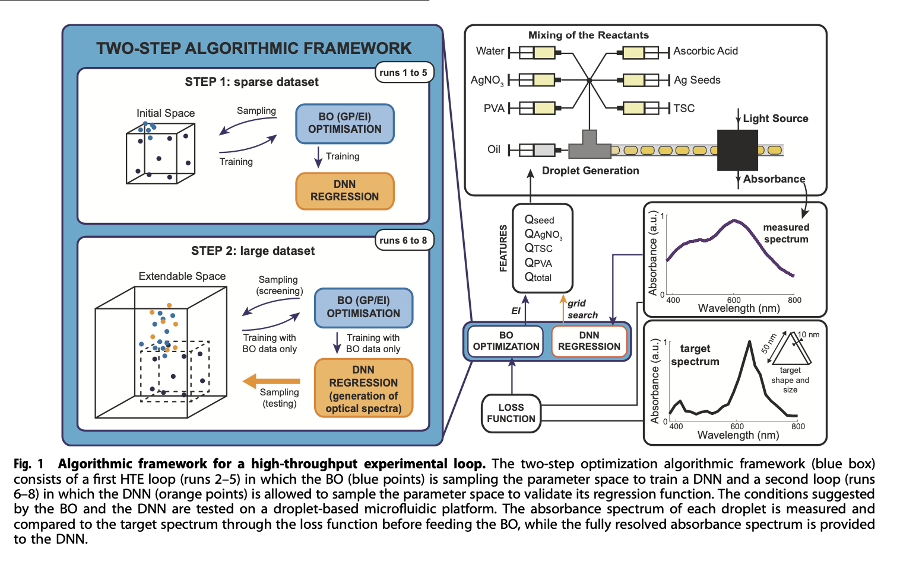
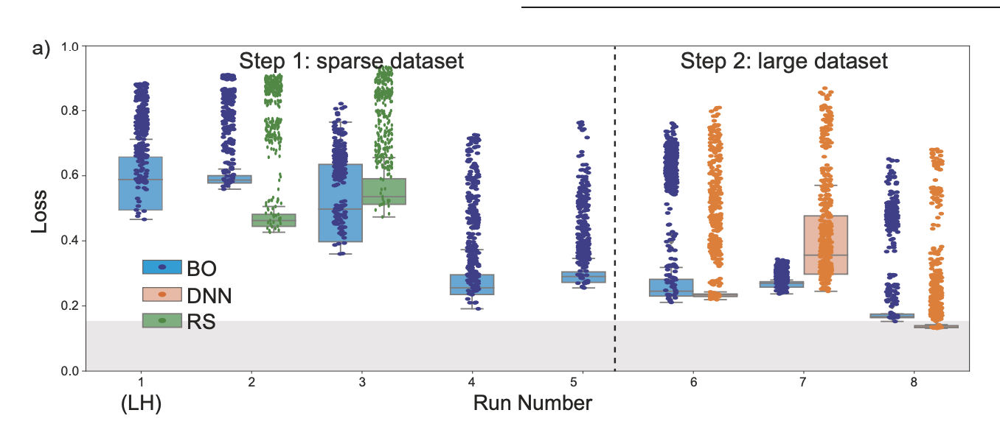
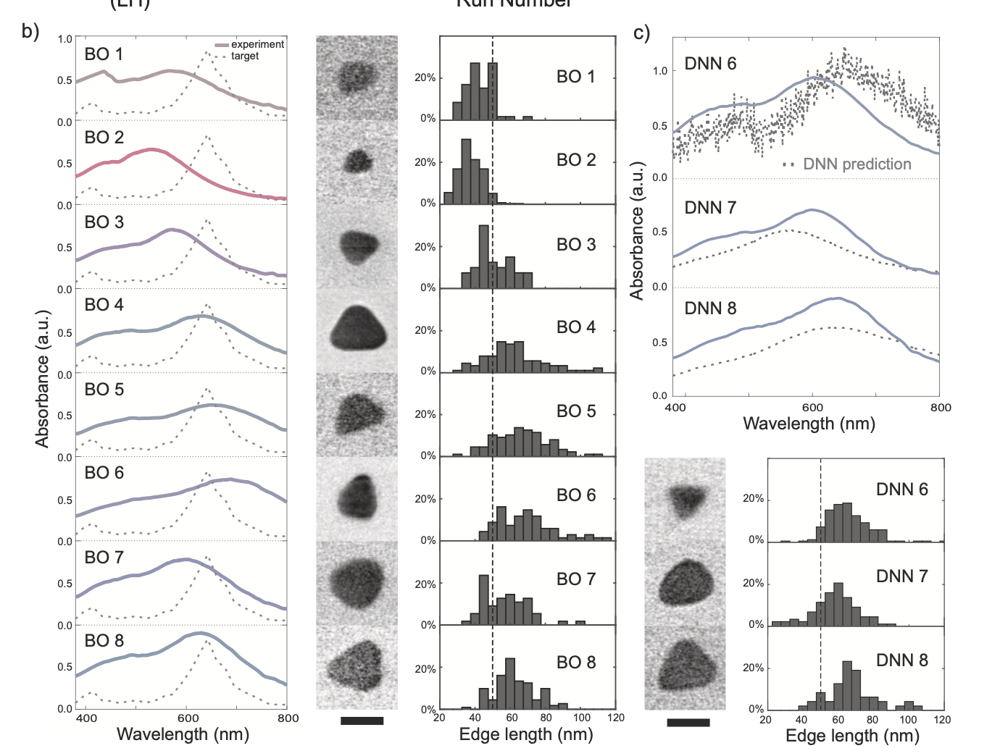
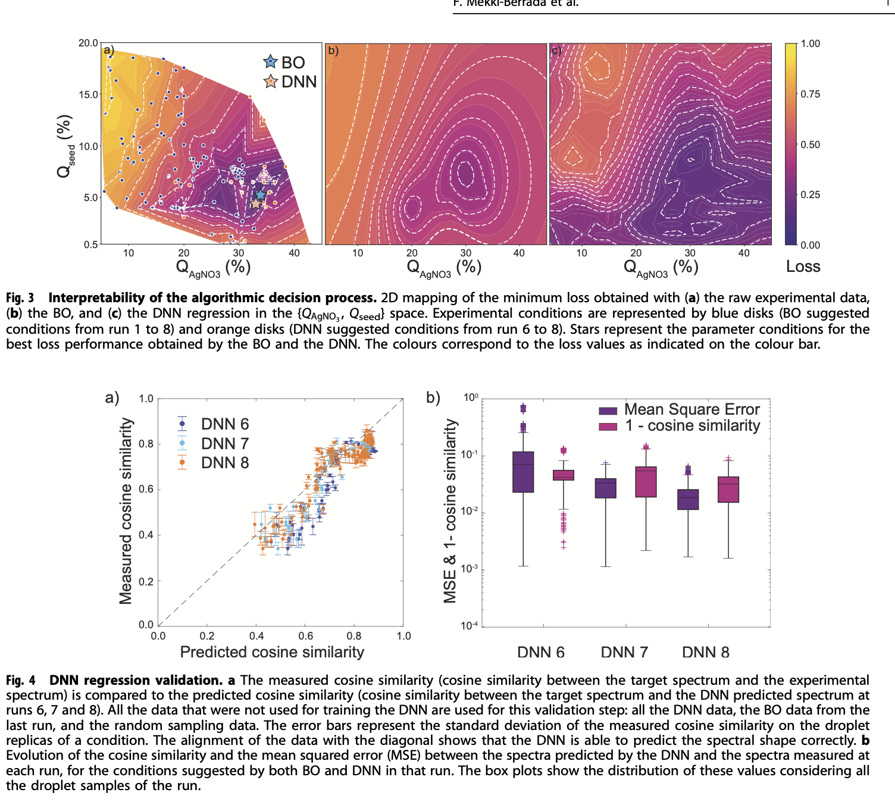
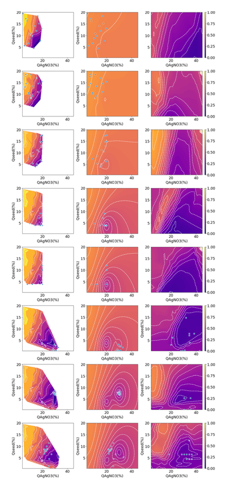
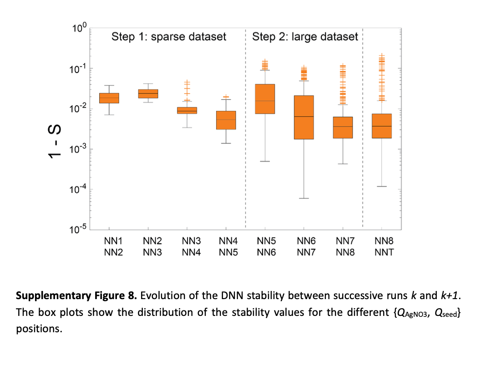
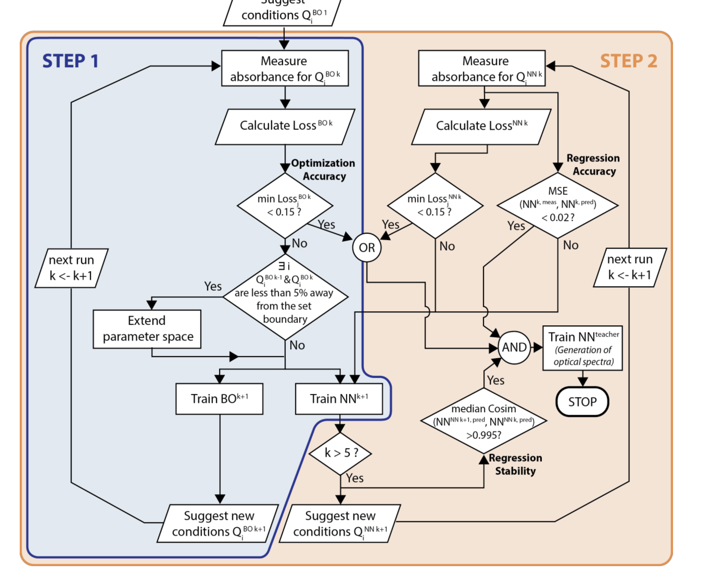

# [Two-step machine learning enables optimized nanoparticle synthesis](https://www.nature.com/articles/s41524-021-00520-w)

- 어떤 계기로 화학 분야에서 머신러닝을 활용하는 논문을 자세하게 읽었다. 
- 화학 실험에서 입력값 (= 질산화은의 농도 / 시드 물질의 농도 등) 을 조절해서 출력값 (= 나노 입자의 광학적 특성) 예측하려는 문제를 푼다.
- Machine Learning 을 활용해서 입력과 출력 사이의 함수를 근사시키고, 근사된 함수를 통해서 최적화 및 도메인 지식을 추출하는 형태로 구성되어있다. 
- 아래와 같은 요소들은 꽤 흥미로웠음 
  - Latin HyperCube Sampling 와 같은 초기 데이터 샘플링 방법
  - Hyperparameter 최적화에서 사용하는 Bayesian Optimization 은 하나의 포인트씩 다음 포인트를 샘플링하는 것과 다르게, 화학 실험은 비용이 많이 들기 때문에 batch bayesian optimization 을 사용하는 것
  - SHAP 를 이용해서 가장 영향력 있는 요소를 찾아내고, 실험이 타겟하는 공간을 모델링하는 것
- https://github.com/acceleratedmaterials/AgBONN/tree/main 에 코드와 데이터가 함께 있어서 깊이 이해하기에 도움이 되었음

## Problem 
- 재료 과학 분야에서는 미리 정의된 광학적 특성을 가지는 나노 입자를 발견하는 것은 재료 과학에서 비용과 시간이 많이 든다. 비용을 낮추고 싶다.

## Contribution
- 이 논문은 Bayesian 최적화 및 DNN 모델을 사용하여 사용하여 나노 입자의 광학적 특성을 최적화하는 레시피를 찾는 방법을 제시한다.
- DNN 모델을 토해서 흡스 스펙트럼과 각 반응물이 스펙트럼에 미치는 영향을 예측하여 기본적 지식 추출이 가능함을 보여준다.

## Expriement - Overview
- 화학 실험 후 데이터를 축적하고 축적된 데이터를 통해서 ML 모델을 학습하고 다음 최적점을 찾기 위한 실험을 반복
- Target loss function 은 관찰된 Spectrum 과 목표 Spectrum 사이의 Cosine Similarity 를 통해서 정의 ( = Wavelength 가 descrete 하기 때문에 각 Spectrum 의 강도를 통해서 Vector 로 표현하고 Cosine Similarity 를 통해서 측정한 유사도를 Target 으로 사용 )

- STEP 1 에서는 Bayeskian Optimization(BO) 을 통해서 최적점을 찾기 위한 다음 실험 포인트를 찾고 실험하는 과정을 반복. Aquisition function 은 [Expected Improvement](https://ekamperi.github.io/machine%20learning/2021/06/11/acquisition-functions.html#expected-improvement-ei) 사용
  - 일반적인 BO 방식을 통해 Expected Improvement 를 통해 다음 실험 포인트를 추천
  - 데이터 포인트가 초기 설정한 Boundary 를 넘어가면 Boundary 를 조정해줌 
- STEP 2 에서는 BO을 통해서 얻은 데이터 포인트를 통해서 DNN 모델을 학습시키고, DNN 모델을 통한 Next Point 추천과 BO 을 통한 Next Point 추천을 비교하여 두 방법론의 성능 비교
  - BO 의 surrogate model은 Input 에서 Loss 모델링하여, Loss 를 기반으로 다음 실험 포인트를 추천하고, DNN 의 경우는 Input 에서 Spectrum 을 예측하는 직접적인 모델링 후 DNN 이 예측한 Loss 가 가장 적을 것으로 추정되는 지점을 다음 실험 포인트로 추천

- 실험의 반복을 통해서 Round 8 에서 DNN 을 통한 Optimization 이 BO 보다 더 빠르게 목표 ( = 위 그림에서 아래 회색 영역 ) 에 도달함을 보여줌

- Round 가 진행되면서 BO 를 통해 Sampling 한 실험 데이터가 Target Spectrum 에 가까워 지는 것 확인할 수 있었으며 
- DNN 의 예측 결과는 실제 실험 결과와 유사해지는 것 확인 할 수 있음

- 학습된 모델을 [SHAP](https://github.com/shap/shap) 이용해서 $(Q_{seed}, Q_{AgNO_3})$ 가 가장 중요한 변수임을 알아냈음 
- 실험을 종료 후 DNN 과 BO 로 예측한 Loss 값을 $(Q_{seed}, Q_{AgNO_3})$ 에 대해서 그려보면 Fig3 와 같이 예측. 별 모양으로 예측한 부분이 최적점임
- DNN 으로 예측한 결과가 실제 실험값과 얼마나 일치하는지를 Fig4 에서 확인할 수 있음. 새로운 포인트에 대한 예측력이 어느정도 유효함을 보여줌

## Experiment - Details
- 첫 샘플링은 [Latin HyperCube Sampling](https://en.wikipedia.org/wiki/Latin_hypercube_sampling) 을 통해서 수행
- BO 알고리즘이 다음 적당히 다음 15개 포인트를 선정
  - 특이하게, BO 과정에서 Batch Sampling ( n = 15 ) 를 수행. 화학 실험과 같은 형태에서는 Batch 로 샘플링해서 실험 결과를 얻는 것이 효과적이라 [Batch Bayesian Optimization via Local Penalization](https://arxiv.org/pdf/1505.08052.pdf) 을 참조해서 Batch 로 Sampling
  - BO 업데이트는 n번 수행 후 Loss ( = 보상함수 ) 의 medium 값을 사용했음
  - Gaussain Process Regression 를 surrogate model 로 사용
- 실험은 총 9개 Run 으로 구성
  - 하나의 Run 은 15개의 화학 조건에서 수행  
  - 한 조건에 대해서 실험 오차를 감안해서 반복 실험을 n 회 수행 후 중간 값을 BO 의 Loss 로 사용했음 
  - 15개 포인트 추천하는 것 6번 하고 ( 1 run ~ 6 run )
  - DNN + BO 를 동시에 사용해서 다음 15개 포인트 추천했음 ( 7 ~ 9 run )
    - BO 는 일반적인 형태로 EI 를 이용해서 샘플링
    - BO 로 샘플링하는 과정에서 Boundary 에 가깝게 계속 추천 → 경계를 넘어서도록 조정했다고 함 → flow rate 조정
  - DNN 은 grid 내에서 loss function 을 최소화하는 조건을 찾아서 샘플링했다고 함
    - DNN 은 예측된 Spectrum 이 Target 과 Loss 가 가장 낮은 포인트를 기준으로 샘플링
  - 15개를 배치 샘플링 → BO 와 결과를 비교 가능 → 1 RUN 에서 찾아낸 가장 낮은 Loss 를 이용해서 비교
- BO 그리고 DNN based grid optimization 사용했다고 함
    - 특정 시점 이후부터는 ~ 해서 BO 와 DNN 성능 비교했다고 함
- 검증
    - AGNP 의 TEM 이미지 (= 현미경 이미지 ) 를 통해서 했다고 함

## Discussion
- 학습된 DNN 모델을 통해서 Knowledge Extraction
  - 이를 위해서 DNN 의 Stability 와 Accuracy 를 논증하기 위한 보충 자료를 제시 
  - Accuracy 는 DNN 을 통해서 Sampling 된 포인트를 테스트 세트로 ( BO 를 통해서 샘플링한 것으로 학습 ) 
    - Spectrum 상의 Cosine Similarity 를 통해서 측정
    - Spectrum 의 MSE 를 통해서 측정
  - Stability 
    - BO 에 비해서 DNN 은 Loss function 의 추정값이 데이터 변화에 따라 급격하게 바뀜
    
    - 일부 Parameter 고정한 채 연속적인 두 실험의 예측 결과의 Cosine similarity 를 통해서 변화가 어느정도 수렴했는지를 측정했음
    
- 학습된 DNN 을 모델을 통해서 parameter space 에서의 Spectrum 을 예측하였음

## 메모들 

- BO 를 `언제 종료`했는지
  -`stop condition` 이 존재 
    - `Loss` 가 특정 수준 이하로 떨어졌는지 
    - `Regression Stability` ( = 연속된 median 값이 계속 유지 되는지 )
    - `Regression Accuray` ( 새롭게 샘플링 된 테스트 세트에서 적절한 수준의 MSE 값에 도달했는지 )
- BO 가 `잘 작동하고 있다는 것을 어떻게 알았는지`
    - DNN 과정에서 test 세트를 샘플링 해서 loss 가 줄고 있는지 체크
- `어느정도 규모의 데이터`가 필요하다고 생각했는지
    - 90개를 사용하되, 실험 오차를 고려해서 한 데이터 포인트를 10 ~ 20번 샘플링 했다.
- `하이퍼파라메터`는 어떻게 튜닝했고 초기 값 설정은 어떻게 했는지 ?
    - GPR 의 파라메터는 default 값을 그냥 쓰더라 ( length scale = 1 / nu = 2.5 ) ( [ref 1](https://github.com/SheffieldML/GPy/blob/0c5de0708a7e103ee04cab1e6cd34bdc8ddbf573/GPy/kern/src/stationary.py#L75) / [ref 2](https://github.com/SheffieldML/GPyOpt/blob/46f9efb8dafedc58634865945643e08be27838c9/GPyOpt/models/gpmodel.py#L58) )
- `피쳐엔지니어링`은 어떻게 했는지 ? 
    - 스펙트럼에 대해서 cosine similarity 정의해서 loss 로 사용
